# Saving voice notes from Telegram

<!-- sop-section-start: summary -->
## Summary

- Purpose: To save voice notes from Telegram and use the Groq Console for transcribing.
- Outcome: It helps keep voice messages organized so they can be easily used as a reference later.
- Trigger: When there is a new voice message that can be used for a task.
- Frequency: As needed when useful voice notes are received.
<!-- sop-section-end -->

<!-- sop-section-start: prerequisites -->
## Prerequisites

- Access: Telegram chat and Groq Console.
- Tools: Telegram desktop and Groq Console Whisper transcription.
- Inputs: Telegram voice note audio file.
<!-- sop-section-end -->

<!-- sop-section-start: procedure -->
## Procedure

<!-- sop-group-start: "Downloading the voice note" -->
### Downloading the voice note

<!-- sop-step-start id=1 -->
1.  Open the Telegram app on your computer and go to the DTC Chat.

    <!-- sop-screenshot-start -->
    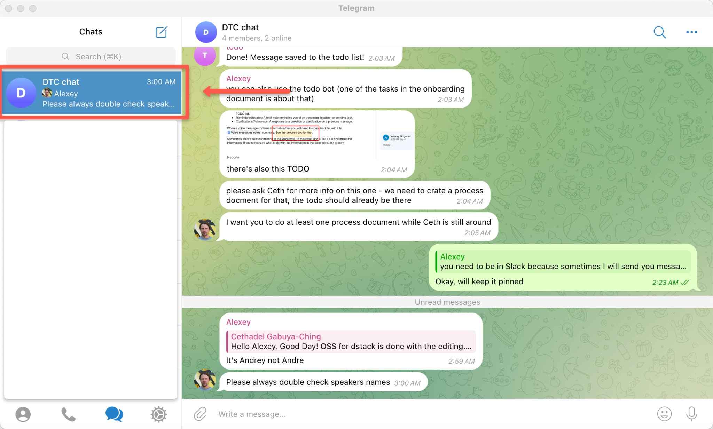
    <!-- sop-caption-start -->
    This screenshot anchors the step to open the Telegram app on your computer and go to the DTC Chat so you can match the documented UI before acting. Look for the relevant screen area shown there, then use it to confirm you are in the correct place before continuing.
    <!-- sop-caption-end -->
    <!-- sop-screenshot-end -->
<!-- sop-step-end -->

<!-- sop-step-start id=2 -->
2.  Scroll up to the voice note you need to save and click the download button.

    Note: The download button will look like a downward ↓ arrow. Once downloaded, it turns into a “play” button as shown below.

    <!-- sop-screenshot-start -->
    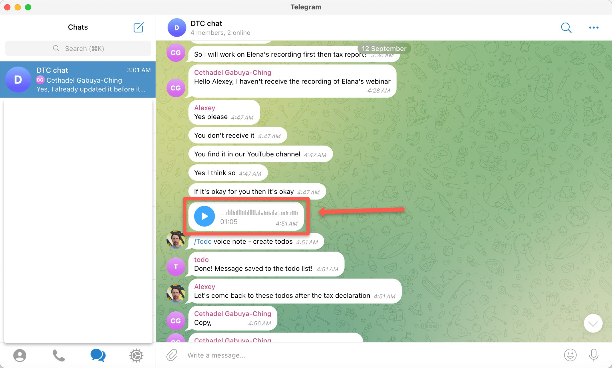
    <!-- sop-caption-start -->
    This screenshot anchors the step about the download button will look like a downward ↓ arrow. Once downloaded, it turns into a “play” button as shown below so you can match the documented UI before acting. Look for “play”, then use that cue to complete or verify the step before continuing.
    <!-- sop-caption-end -->
    <!-- sop-screenshot-end -->
<!-- sop-step-end -->

<!-- sop-step-start id=3 -->
3.  Once downloaded, right-click the voice note to open a pop-up menu. On this menu, click “Save as…”.

    <!-- sop-screenshot-start -->
    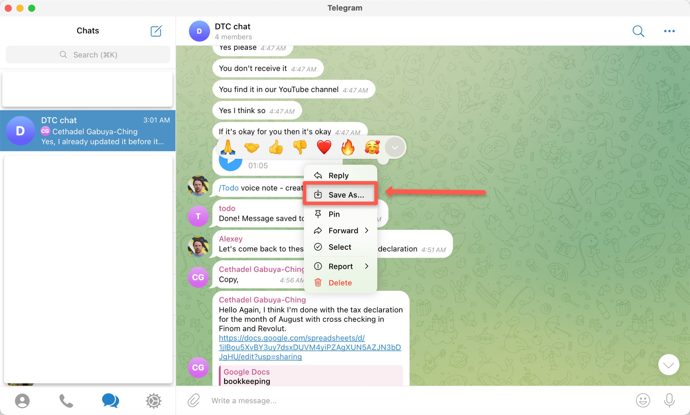
    <!-- sop-caption-start -->
    This screenshot anchors the step about once downloaded, right-click the voice note to open a pop-up menu. On this menu, click “Save as…” so you can match the documented UI before acting. Look for “Save as…”, then use that cue to complete or verify the step before continuing.
    <!-- sop-caption-end -->
    <!-- sop-screenshot-end -->
<!-- sop-step-end -->

<!-- sop-step-start id=4 -->
4.  Choose where to save the voice note in your folder.

    <!-- sop-screenshot-start -->
    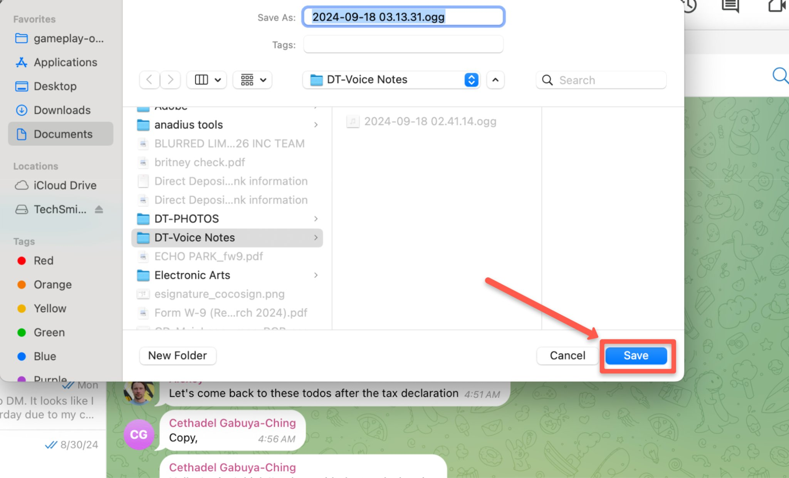
    <!-- sop-caption-start -->
    This screenshot anchors the step to choose where to save the voice note in your folder so you can match the documented UI before acting. Look for the folder or Drive location shown there, then use it to confirm you are in the correct place before continuing.
    <!-- sop-caption-end -->
    <!-- sop-screenshot-end -->
<!-- sop-step-end -->

<!-- sop-group-end -->

<!-- sop-group-start: "Transcribing with Groq" -->
### Transcribing with Groq

<!-- sop-step-start id=5 -->
5.  Open the [Groq](https://console.groq.com/playground) application on your browser then click “llama3-8b-8192” on the upper right corner of the screen to reveal a drop-down list. Select “whisper-large-v3” on this list.

    <!-- sop-screenshot-start -->
    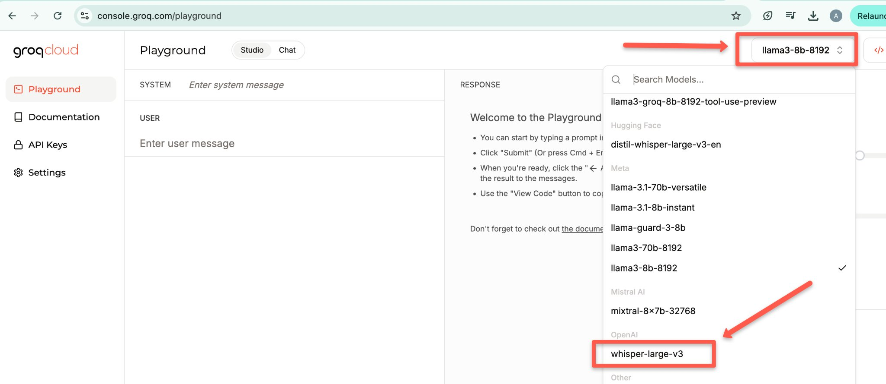
    <!-- sop-caption-start -->
    This screenshot anchors the step to open the Groq application on your browser then click “llama3-8b-8192” on the upper right corner of the screen to reveal a... so you can match the documented UI before acting. Look for “llama3-8b-8192” and “whisper-large-v3”, then use those cues to complete or verify the step before continuing.
    <!-- sop-caption-end -->
    <!-- sop-screenshot-end -->
<!-- sop-step-end -->

<!-- sop-step-start id=6 -->
6.  With “whisper-large-v3” selected, the screen will change to a file upload screen. Click “Select File” to open your file browser.

    <!-- sop-screenshot-start -->
    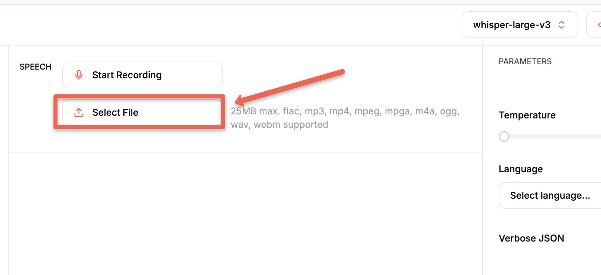
    <!-- sop-caption-start -->
    This screenshot anchors the step about with “whisper-large-v3” selected, the screen will change to a file upload screen. Click “Select File” to open your file br... so you can match the documented UI before acting. Look for “whisper-large-v3” and “Select File”, then use those cues to complete or verify the step before continuing.
    <!-- sop-caption-end -->
    <!-- sop-screenshot-end -->
<!-- sop-step-end -->

<!-- sop-step-start id=7 -->
7.  Select the voice note you downloaded in Step 4 of this document in your file browser then click “Open”.

    <!-- sop-screenshot-start -->
    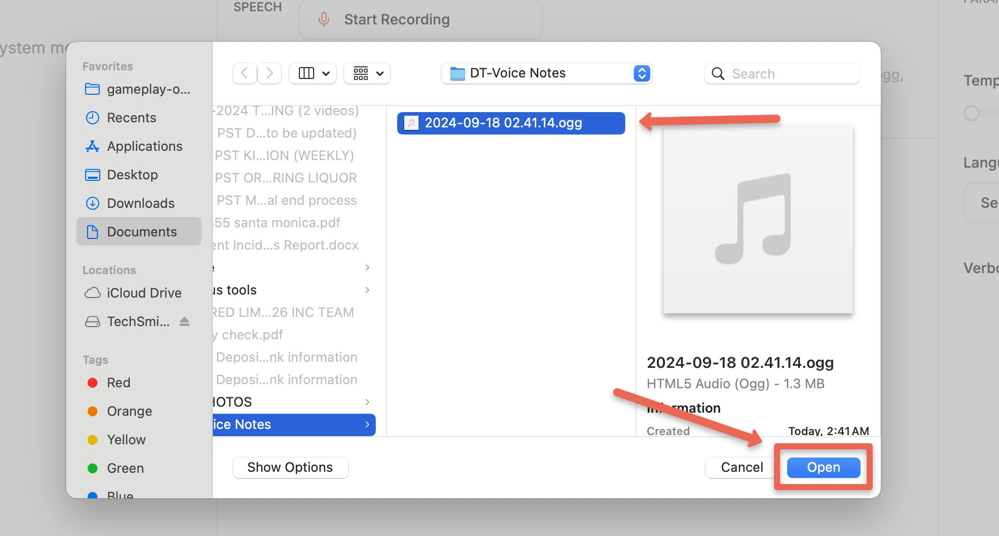
    <!-- sop-caption-start -->
    This screenshot anchors the step to select the voice note you downloaded in Step 4 of this document in your file browser then click “Open” so you can match the documented UI before acting. Look for “Open”, then use that cue to complete or verify the step before continuing.
    <!-- sop-caption-end -->
    <!-- sop-screenshot-end -->
<!-- sop-step-end -->

<!-- sop-step-start id=8 -->
8.  The voice recording is now uploaded on Groq. Click “Submit” on the bottom part of the screen to start the transcription.

    <!-- sop-screenshot-start -->
    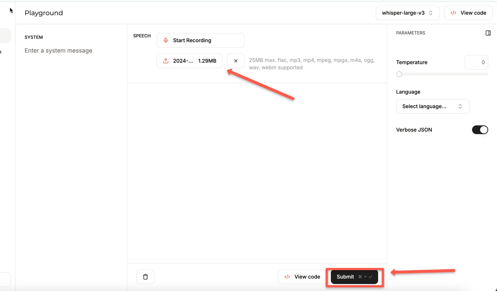
    <!-- sop-caption-start -->
    This screenshot anchors the step about the voice recording is now uploaded on Groq. Click “Submit” on the bottom part of the screen to start the transcription so you can match the documented UI before acting. Look for “Submit”, then use that cue to complete or verify the step before continuing.
    <!-- sop-caption-end -->
    <!-- sop-screenshot-end -->
<!-- sop-step-end -->

<!-- sop-step-start id=9 -->
9.  Once the transcription is done and the text from the recording appears, click the “Text” tab beside “Segments”.

    <!-- sop-screenshot-start -->
    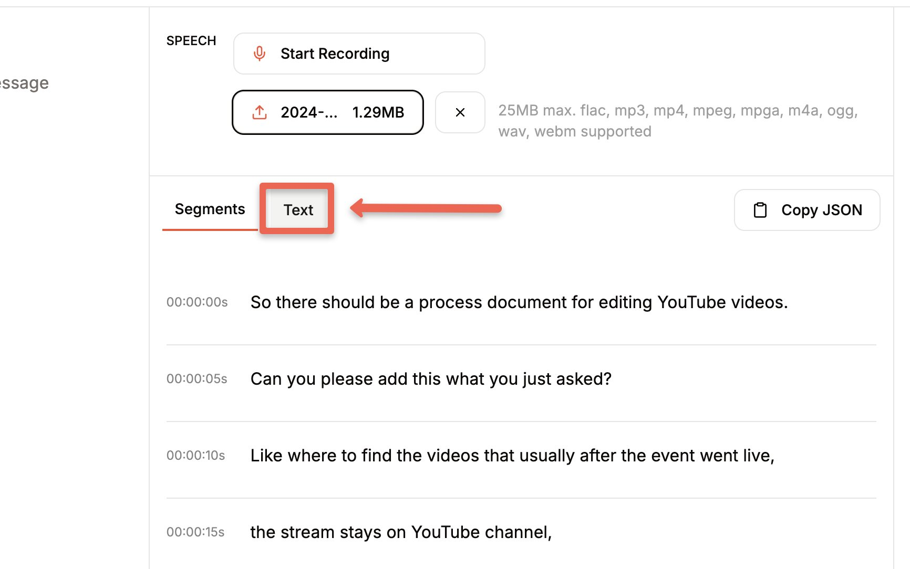
    <!-- sop-caption-start -->
    This screenshot anchors the step about once the transcription is done and the text from the recording appears, click the “Text” tab beside “Segments” so you can match the documented UI before acting. Look for “Text” and “Segments”, then use those cues to complete or verify the step before continuing.
    <!-- sop-caption-end -->
    <!-- sop-screenshot-end -->
<!-- sop-step-end -->

<!-- sop-step-start id=10 -->
10. The transcribed text is now ready to be copied.

    <!-- sop-screenshot-start -->
    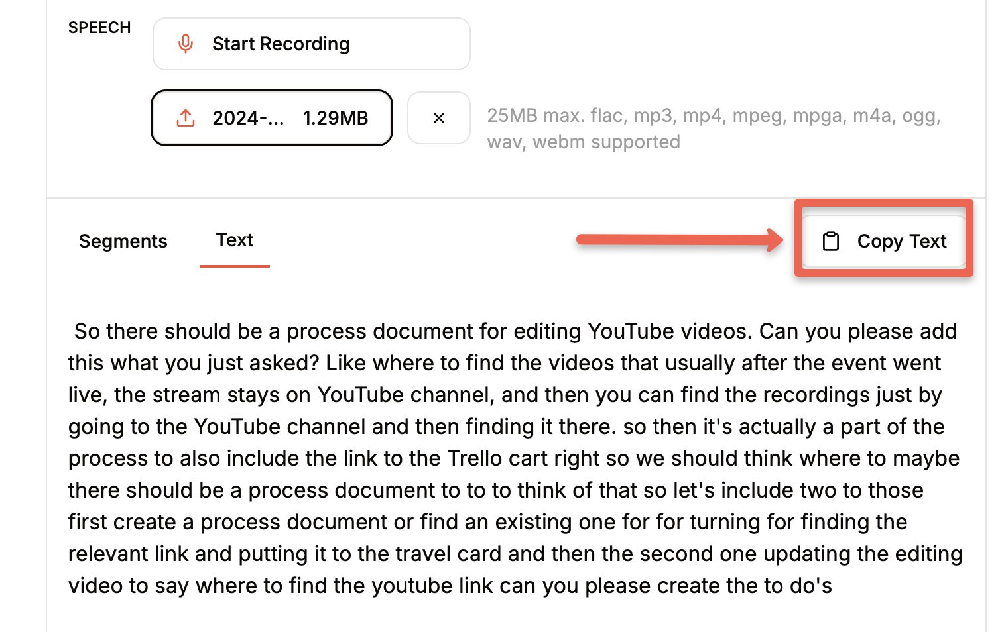
    <!-- sop-caption-start -->
    This screenshot anchors the step about the transcribed text is now ready to be copied so you can match the documented UI before acting. Look for the relevant screen area shown there, then use it to confirm you are in the correct place before continuing.
    <!-- sop-caption-end -->
    <!-- sop-screenshot-end -->
<!-- sop-step-end -->

<!-- sop-group-end -->

<!-- sop-group-start: "Summarizing tasks from the voice note with ChatGPT" -->
### Summarizing tasks from the voice note with ChatGPT

<!-- sop-prose-start -->
m,2t
<!-- sop-prose-end -->

<!-- sop-step-start id=11 -->
11. Open [ChatGPT](http://chatgpt.com).

    <!-- sop-screenshot-start -->
    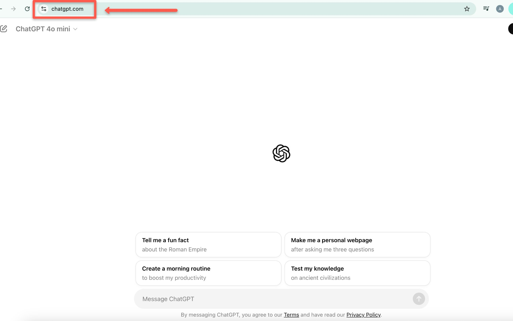
    <!-- sop-caption-start -->
    This screenshot anchors the step to open ChatGPT so you can match the documented UI before acting. Look for the relevant screen area shown there, then use it to confirm you are in the correct place before continuing.
    <!-- sop-caption-end -->
    <!-- sop-screenshot-end -->
<!-- sop-step-end -->

<!-- sop-step-start id=12 -->
12. Now, copy and paste the text below into the chat box on ChatGPT. This is the prompt for ChatGPT.

    “Based on the provided transcript of the voice note, give me the summary of this voice note and all the actions that I need to perform based on the transcript of the voice note.

    Transcript:”

    Note: Remove quotation marks (“).

    <!-- sop-screenshot-start -->
    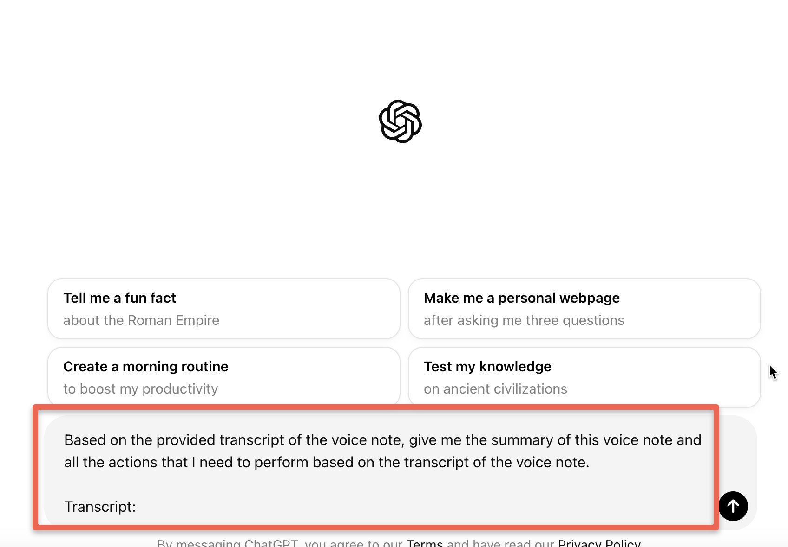
    <!-- sop-caption-start -->
    This screenshot anchors the step about transcript:” so you can match the documented UI before acting. Look for the relevant screen area shown there, then use it to confirm you are in the correct place before continuing.
    <!-- sop-caption-end -->
    <!-- sop-screenshot-end -->
<!-- sop-step-end -->

<!-- sop-step-start id=13 -->
13. Return to Groq where you have the transcribed note and click “Copy Text”.

    <!-- sop-screenshot-start -->
    
    <!-- sop-caption-start -->
    This screenshot anchors the step to return to Groq where you have the transcribed note and click “Copy Text” so you can match the documented UI before acting. Look for “Copy Text”, then use that cue to complete or verify the step before continuing.
    <!-- sop-caption-end -->
    <!-- sop-screenshot-end -->
<!-- sop-step-end -->

<!-- sop-step-start id=14 -->
14. On ChatGPT, let’s add the transcribed voice note to the prompt we added earlier. Paste the text you copied under the word “Transcript:”. Then, hit “Enter” on your keyboard.

    <!-- sop-screenshot-start -->
    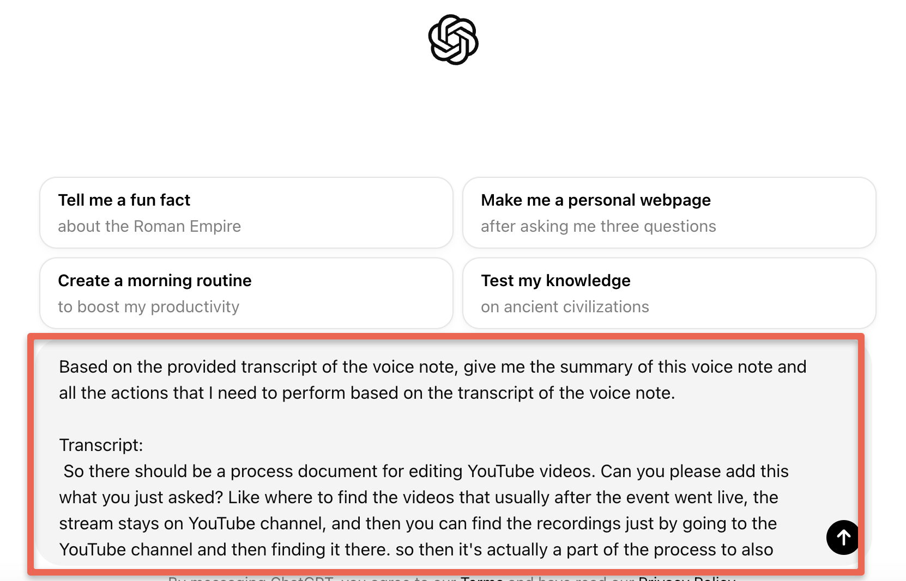
    <!-- sop-caption-start -->
    This screenshot anchors the step about on ChatGPT, let’s add the transcribed voice note to the prompt we added earlier. Paste the text you copied under the word... so you can match the documented UI before acting. Look for “Transcript:” and “Enter”, then use those cues to complete or verify the step before continuing.
    <!-- sop-caption-end -->
    <!-- sop-screenshot-end -->
<!-- sop-step-end -->

<!-- sop-step-start id=15 -->
15. ChatGPT will now generate a summary of tasks from the voice note.

    <!-- sop-screenshot-start -->
    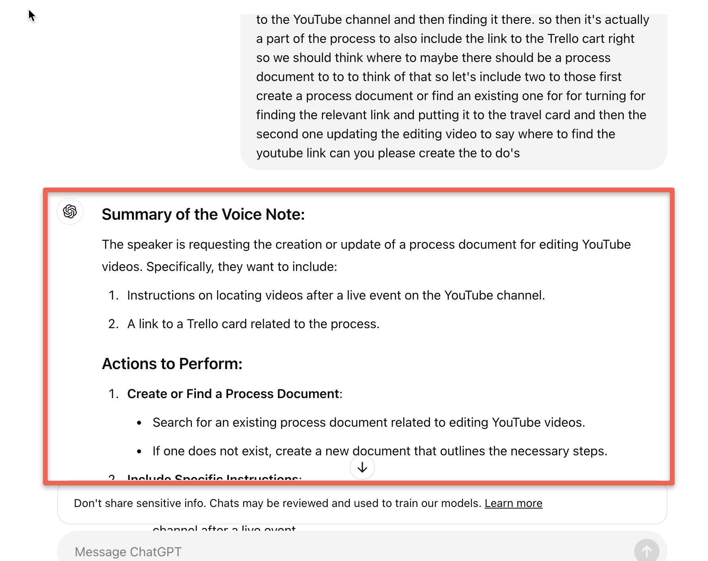
    <!-- sop-caption-start -->
    This screenshot anchors the step about chatGPT will now generate a summary of tasks from the voice note so you can match the documented UI before acting. Look for the relevant screen area shown there, then use it to confirm you are in the correct place before continuing.
    <!-- sop-caption-end -->
    <!-- sop-screenshot-end -->
<!-- sop-step-end -->

<!-- sop-step-start id=16 -->
16. Scroll down to the end of the summary and click the “copy” icon on the lower left to copy the summary.

    <!-- sop-screenshot-start -->
    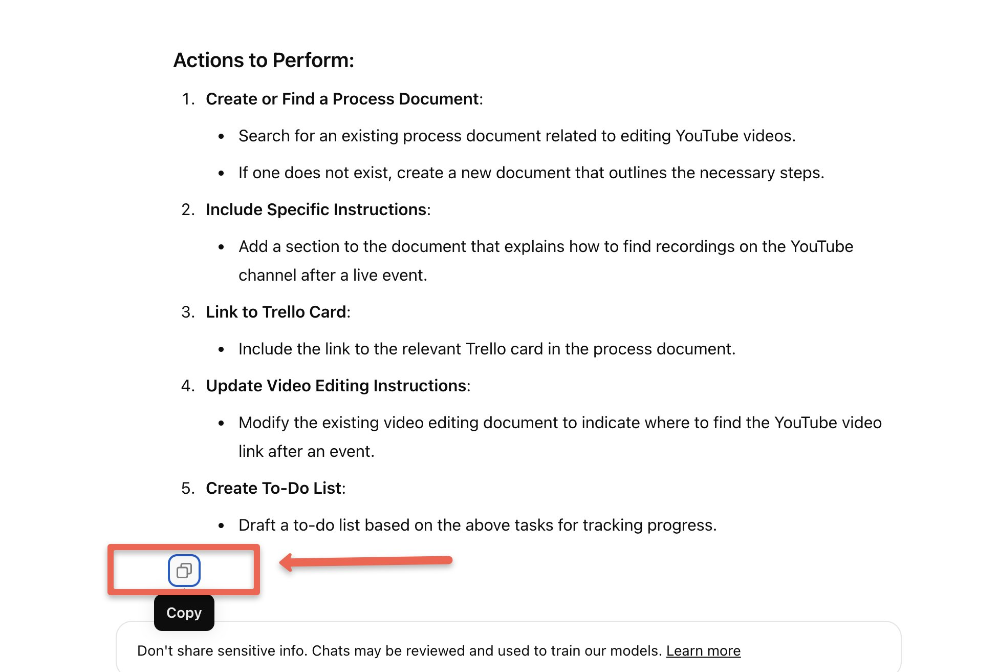
    <!-- sop-caption-start -->
    This screenshot anchors the step to scroll down to the end of the summary and click the “copy” icon on the lower left to copy the summary so you can match the documented UI before acting. Look for “copy”, then use that cue to complete or verify the step before continuing.
    <!-- sop-caption-end -->
    <!-- sop-screenshot-end -->
<!-- sop-step-end -->

<!-- sop-step-start id=17 -->
17. Now paste the copied text in the document [Summarized Voice Notes](https://docs.google.com/document/d/1qBTbP-56gJqnUH-v2IDRPA-alkLlLhgKWfDSgjYbYp0/edit) and note down the Date and Length in minutes of the original recording.

    <!-- sop-screenshot-start -->
    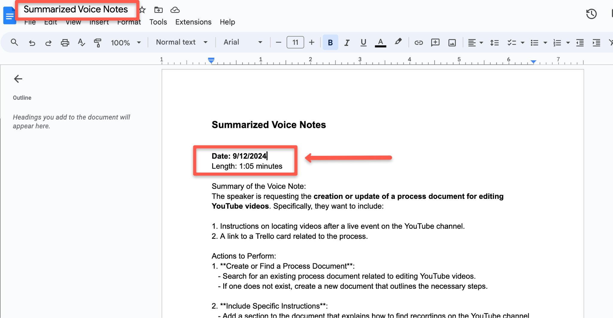
    <!-- sop-caption-start -->
    This screenshot anchors the step to paste the copied text in the document Summarized Voice Notes and note down the Date and Length in minutes of the original... so you can match the documented UI before acting. Look for the schedule or date control shown there, then use it to confirm you are in the correct place before continuing.
    <!-- sop-caption-end -->
    <!-- sop-screenshot-end -->

    Loom links:

    - Downloading voice notes

    - Transcribing voice notes
<!-- sop-step-end -->

<!-- sop-group-end -->
<!-- sop-section-end -->

<!-- sop-section-start: validation -->
## Validation

-
<!-- sop-section-end -->

<!-- sop-section-start: troubleshooting -->
## Troubleshooting

-
<!-- sop-section-end -->

<!-- sop-section-start: references -->
## References

-
<!-- sop-section-end -->
