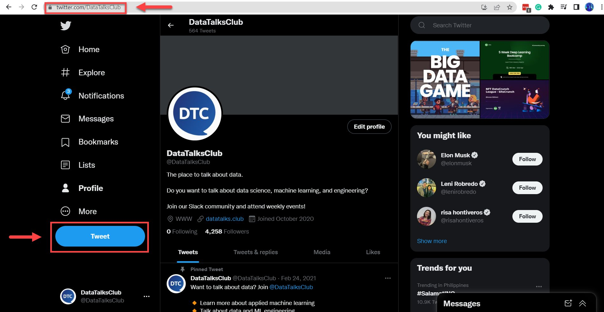
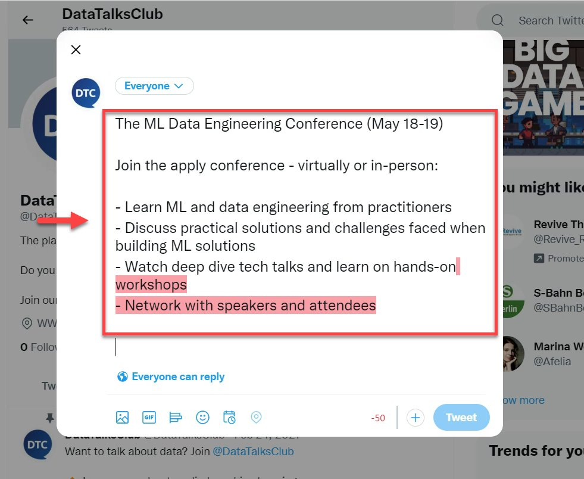
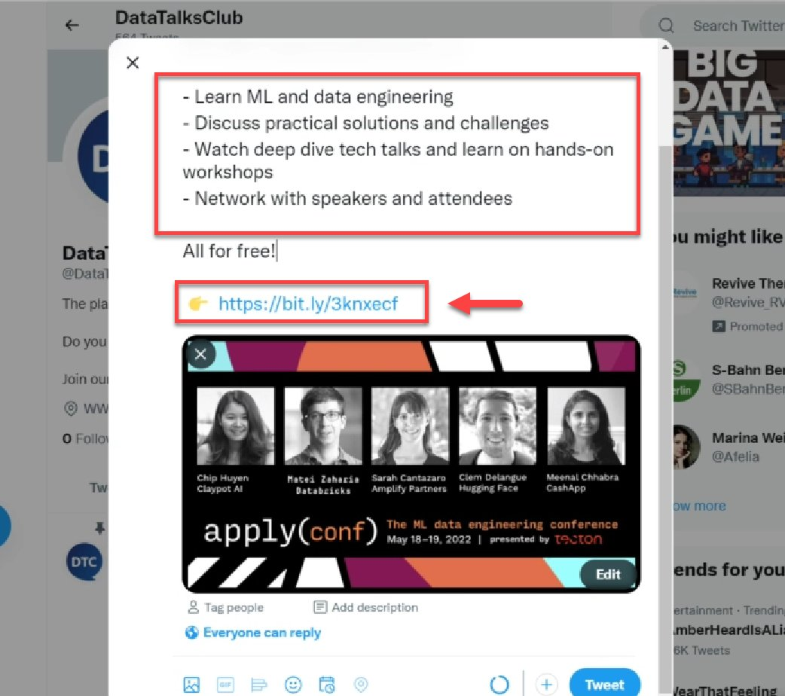
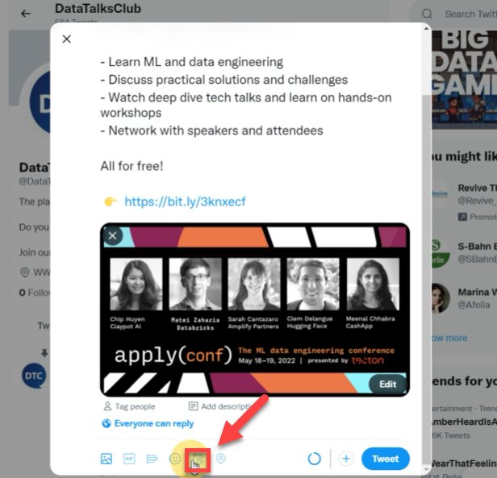
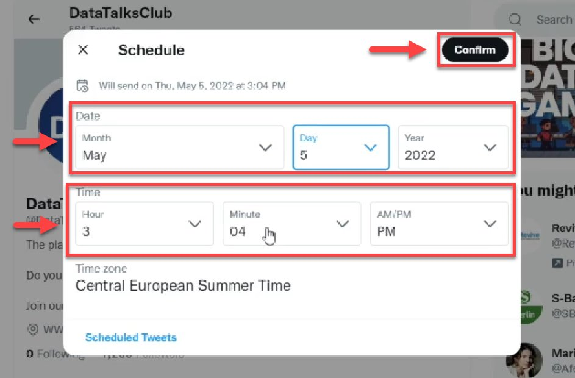
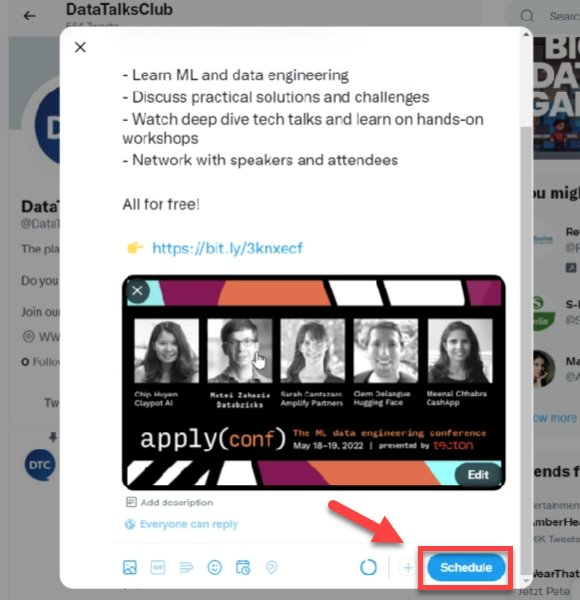
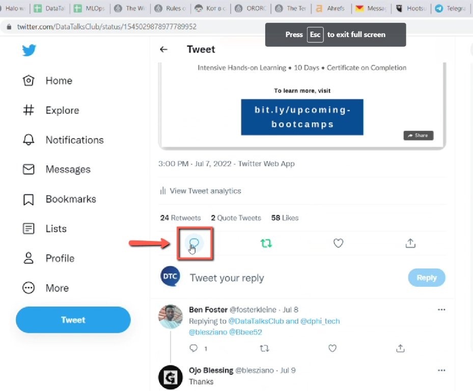
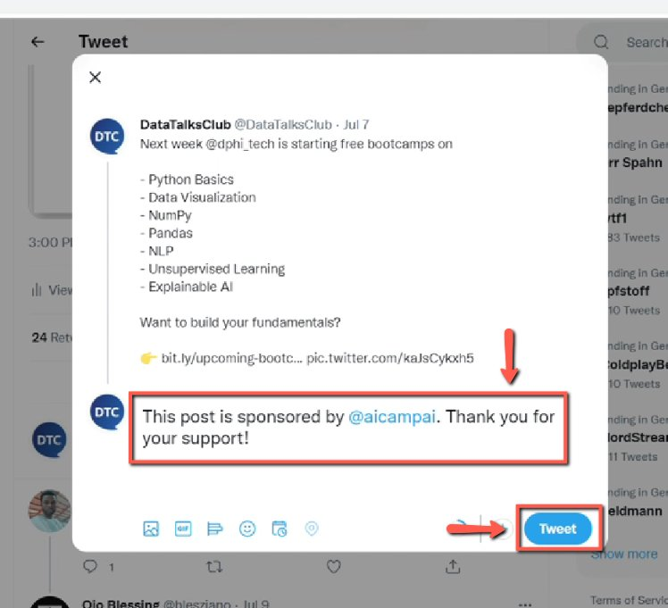

# Schedule posts with Twitter and post about newsletter promotional content

<!-- sop-section-start: summary -->
## Summary

- Purpose: Schedule newsletter promotional content on Twitter/X.
- Outcome: The promotional tweet is scheduled and sponsor disclosure is added after posting.
- Trigger: Newsletter promotional content needs to be posted on Twitter/X.
- Frequency: As needed for newsletter promotions.
<!-- sop-section-end -->

<!-- sop-section-start: prerequisites -->
## Prerequisites

- Access: DataTalks.Club Twitter/X account.
- Tools: Twitter/X scheduler.
- Inputs: Promotional copy, link, schedule date/time, and sponsor disclosure.
<!-- sop-section-end -->

<!-- sop-section-start: procedure -->
## Procedure

<!-- sop-prose-start -->
How to schedule posts with Twitter and post about newsletter promotional content
This procedure will show you the steps on how to schedule posts with Twitter and post about newsletter promotional content

Step-by-step Instructions
<!-- sop-prose-end -->

<!-- sop-step-start id=1 -->
1.  The first thing you need to do is open [DataTalks.club Twitter](https://twitter.com/DataTalksClub) account and click “Tweet”

    <!-- sop-screenshot-start -->
    
    <!-- sop-caption-start -->
    This screenshot anchors the step to open DataTalks.club Twitter account and click “Tweet” so you can match the documented UI before acting. Look for “Tweet”, then use that cue to complete or verify the step before continuing.
    <!-- sop-caption-end -->
    <!-- sop-screenshot-end -->
<!-- sop-step-end -->

<!-- sop-step-start id=2 -->
2.  And then, enter the title and the description of the newsletter promotional content.

    Note: Twitter has a text limit. With this, we need to erase some descriptions and make the text shorter so that it will not exceed the limit. Don’t forget to follow [proper punctuation](https://docs.google.com/document/d/192lEpUc6WemtooqcqNiHub-7OTTJAHe2k-mJg-bUWYI/edit?usp=sharing) and spacing.

    <!-- sop-screenshot-start -->
    
    <!-- sop-caption-start -->
    This screenshot anchors the step to enter the title and the description of the newsletter promotional content so you can match the documented UI before acting. Look for the relevant screen area shown there, then use it to confirm you are in the correct place before continuing.
    <!-- sop-caption-end -->
    <!-- sop-screenshot-end -->
<!-- sop-step-end -->

<!-- sop-step-start id=3 -->
3.  To proceed, use emojis to save space.

    Note: Inside the box is an example of the shorter version of the description from Step 2. Make sure to the link is always the same thing as the newsletter. Moreover, double-check the* [*extra spaces*](https://docs.google.com/document/d/1mTxJE0kjNKObpAHBx9KsLAqOdMEMYPXuB5cBFMd9ce4/edit?usp=sharing) *in the text. Also, don’t include dots in the text.
    <!-- sop-screenshot-start -->
    
    <!-- sop-caption-start -->
    This screenshot anchors the step about inside the box is an example of the shorter version of the description from Step 2. Make sure to the link is always the sa... so you can match the documented UI before acting. Look for the link, copy, or paste target shown there, then use it to confirm you are in the correct place before continuing.
    <!-- sop-caption-end -->
    <!-- sop-screenshot-end -->
<!-- sop-step-end -->

<!-- sop-step-start id=4 -->
4.  On the bottom side of your screen, click the calendar icon to schedule the post.

    <!-- sop-screenshot-start -->
    
    <!-- sop-caption-start -->
    This screenshot anchors the step about on the bottom side of your screen, click the calendar icon to schedule the post so you can match the documented UI before acting. Look for the schedule or date control shown there, then use it to confirm you are in the correct place before continuing.
    <!-- sop-caption-end -->
    <!-- sop-screenshot-end -->
<!-- sop-step-end -->

<!-- sop-step-start id=5 -->
5.  And then, select the date&time you want to schedule the tweet. After selecting, click “confirm”

    <!-- sop-screenshot-start -->
    
    <!-- sop-caption-start -->
    This screenshot anchors the step to select the date&time you want to schedule the tweet. After selecting, click “confirm” so you can match the documented UI before acting. Look for “confirm”, then use that cue to complete or verify the step before continuing.
    <!-- sop-caption-end -->
    <!-- sop-screenshot-end -->
<!-- sop-step-end -->

<!-- sop-step-start id=6 -->
6.  Lastly, select “Schedule”

    <!-- sop-screenshot-start -->
    
    <!-- sop-caption-start -->
    This screenshot anchors the step to select “Schedule” so you can match the documented UI before acting. Look for “Schedule”, then use that cue to complete or verify the step before continuing.
    <!-- sop-caption-end -->
    <!-- sop-screenshot-end -->
<!-- sop-step-end -->

<!-- sop-step-start id=7 -->
7.  Once the Tweet is twitted, click the “comment” icon.

    <!-- sop-screenshot-start -->
    
    <!-- sop-caption-start -->
    This screenshot anchors the step about once the Tweet is twitted, click the “comment” icon so you can match the documented UI before acting. Look for “comment”, then use that cue to complete or verify the step before continuing.
    <!-- sop-caption-end -->
    <!-- sop-screenshot-end -->
<!-- sop-step-end -->

<!-- sop-step-start id=8 -->
8.  And added the description “This post is sponsored by \<Company\>. Thank you for your support!” and click “Tweet”

    <!-- sop-screenshot-start -->
    
    <!-- sop-caption-start -->
    This screenshot anchors the step about and added the description “This post is sponsored by Company. Thank you for your support!” and click “Tweet” so you can match the documented UI before acting. Look for “Tweet”, then use that cue to complete or verify the step before continuing.
    <!-- sop-caption-end -->
    <!-- sop-screenshot-end -->
<!-- sop-step-end -->
<!-- sop-section-end -->

<!-- sop-section-start: validation -->
## Validation

-
<!-- sop-section-end -->

<!-- sop-section-start: troubleshooting -->
## Troubleshooting

-
<!-- sop-section-end -->

<!-- sop-section-start: references -->
## References

-
<!-- sop-section-end -->
