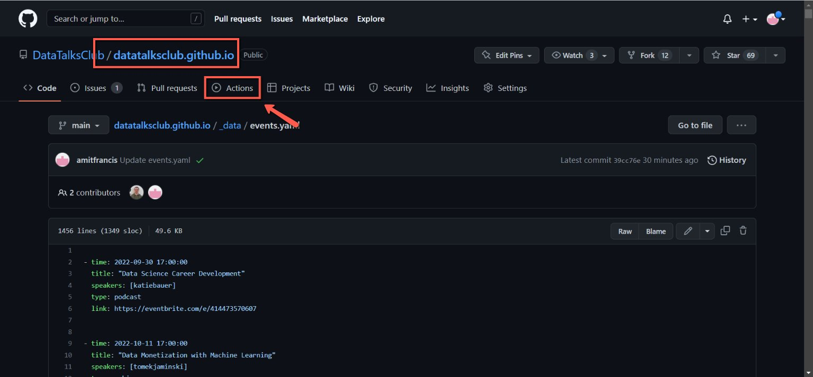
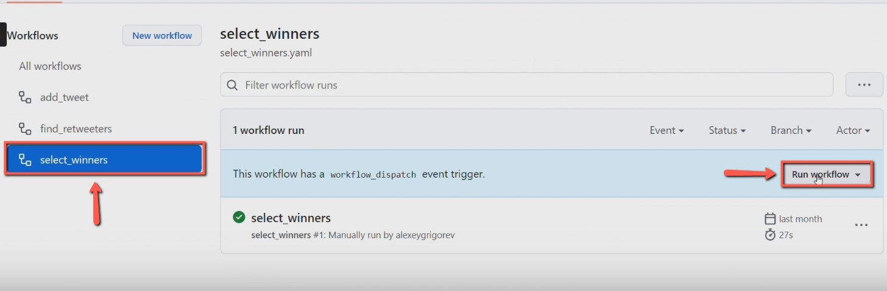
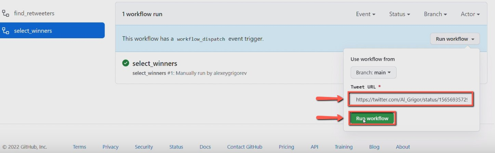
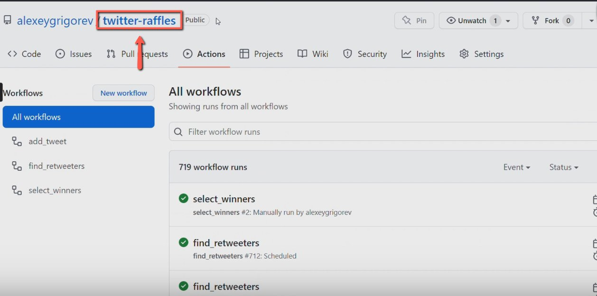
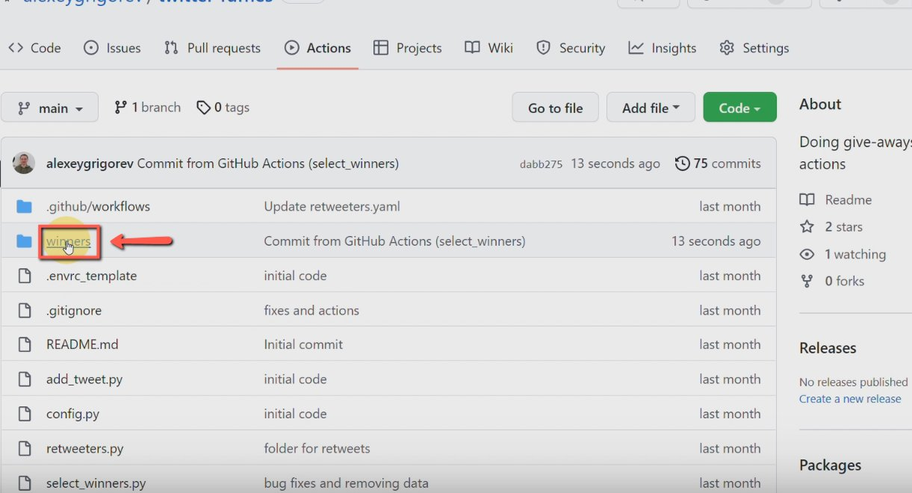
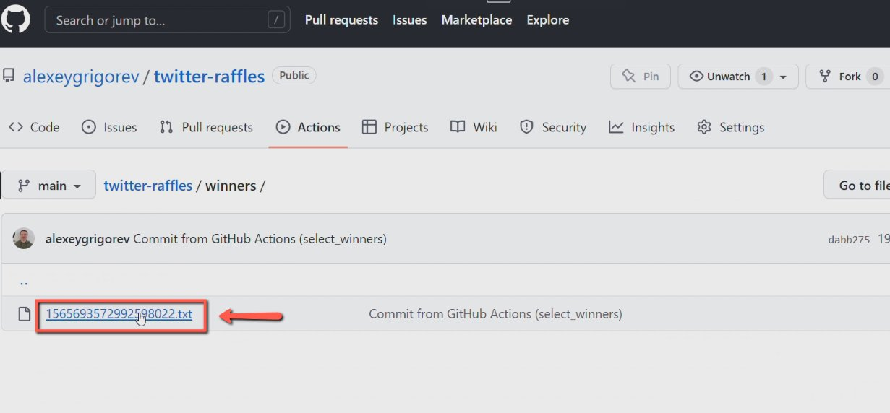
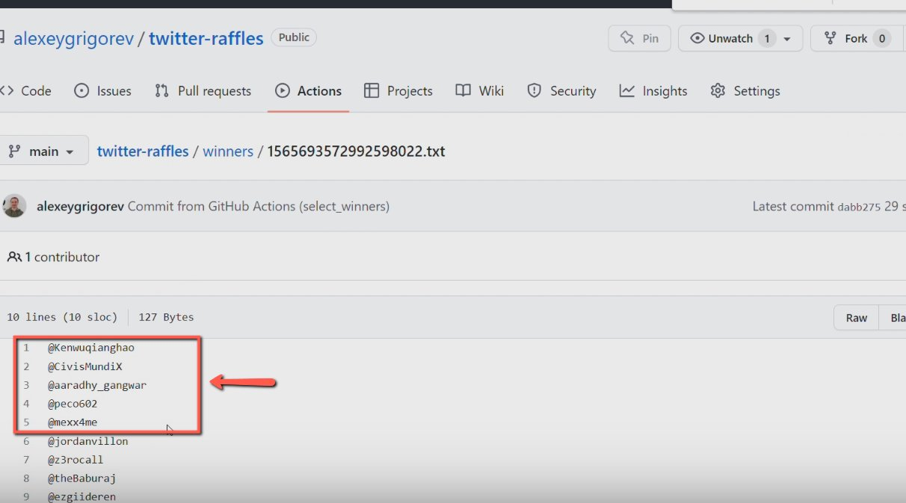

# Selecting giveaway winners on Twitter

<!-- sop-section-start: summary -->
## Summary

- Purpose: Select Twitter/X giveaway winners using the twitter-raffles GitHub workflow.
- Outcome: A winners file is generated and the required number of winners is selected.
- Trigger: A giveaway campaign is ready for winner selection.
- Frequency: After each Twitter/X giveaway campaign.
<!-- sop-section-end -->

<!-- sop-section-start: prerequisites -->
## Prerequisites

- Access: GitHub access to the twitter-raffles repository.
- Tools: GitHub Actions.
- Inputs: Giveaway tweet URL and number of winners needed.
<!-- sop-section-end -->

<!-- sop-section-start: procedure -->
## Procedure

<!-- sop-prose-start -->
How to Select Giveaway winners on Twitter
This procedure will show you the steps on how to select Giveaway winners on Twitter.

Step-by-step Instructions
<!-- sop-prose-end -->

<!-- sop-step-start id=1 -->
1.  The first thing you need to do is open the [GIthub repo](https://github.com/alexeygrigorev/twitter-raffles) and then select “Actions”

    <!-- sop-screenshot-start -->
    
    <!-- sop-caption-start -->
    This screenshot anchors the step to open the GIthub repo and then select “Actions” so you can match the documented UI before acting. Look for “Actions”, then use that cue to complete or verify the step before continuing.
    <!-- sop-caption-end -->
    <!-- sop-screenshot-end -->
<!-- sop-step-end -->

<!-- sop-step-start id=2 -->
2.  After, click “select_winners” and click “Run workflow”

    <!-- sop-screenshot-start -->
    
    <!-- sop-caption-start -->
    This screenshot anchors the step to click “select_winners” and click “Run workflow” so you can match the documented UI before acting. Look for “select_winners” and “Run workflow”, then use those cues to complete or verify the step before continuing.
    <!-- sop-caption-end -->
    <!-- sop-screenshot-end -->
<!-- sop-step-end -->

<!-- sop-step-start id=3 -->
3.  And then, paste the Twitter URL on the field and click “Run workflow”

    <!-- sop-screenshot-start -->
    
    <!-- sop-caption-start -->
    This screenshot anchors the step to paste the Twitter URL on the field and click “Run workflow” so you can match the documented UI before acting. Look for “Run workflow”, then use that cue to complete or verify the step before continuing.
    <!-- sop-caption-end -->
    <!-- sop-screenshot-end -->
<!-- sop-step-end -->

<!-- sop-step-start id=4 -->
4.  Once done, go back and click “twitter-raffles”

    Note: A green-colored check box will appear to signify that the process is done.
    <!-- sop-screenshot-start -->
    
    <!-- sop-caption-start -->
    This screenshot anchors the step about a green-colored check box will appear to signify that the process is done so you can match the documented UI before acting. Look for the post composer or published post shown there, then use it to confirm you are in the correct place before continuing.
    <!-- sop-caption-end -->
    <!-- sop-screenshot-end -->
<!-- sop-step-end -->

<!-- sop-step-start id=5 -->
5.  After, click the “winners” folder

    <!-- sop-screenshot-start -->
    
    <!-- sop-caption-start -->
    This screenshot anchors the step to click the “winners” folder so you can match the documented UI before acting. Look for “winners”, then use that cue to complete or verify the step before continuing.
    <!-- sop-caption-end -->
    <!-- sop-screenshot-end -->
<!-- sop-step-end -->

<!-- sop-step-start id=6 -->
6.  And select the corresponding URL.

    Note: To know which URL is correct, click “Ctrl+F” and find the URL if there are multiple files.
    <!-- sop-screenshot-start -->
    
    <!-- sop-caption-start -->
    This screenshot anchors the step about to know which URL is correct, click “Ctrl+F” and find the URL if there are multiple files so you can match the documented UI before acting. Look for “Ctrl+F”, then use that cue to complete or verify the step before continuing.
    <!-- sop-caption-end -->
    <!-- sop-screenshot-end -->
<!-- sop-step-end -->

<!-- sop-step-start id=7 -->
7.  Lastly, select the top 5 giveaway winners.

    Note: The number of winners will depend on how many copies will be given.
    <!-- sop-screenshot-start -->
    
    <!-- sop-caption-start -->
    This screenshot anchors the step to select the top 5 giveaway winners so you can match the documented UI before acting. Look for the relevant screen area shown there, then use it to confirm you are in the correct place before continuing.
    <!-- sop-caption-end -->
    <!-- sop-screenshot-end -->
<!-- sop-step-end -->
<!-- sop-section-end -->

<!-- sop-section-start: validation -->
## Validation

-
<!-- sop-section-end -->

<!-- sop-section-start: troubleshooting -->
## Troubleshooting

-
<!-- sop-section-end -->

<!-- sop-section-start: references -->
## References

-
<!-- sop-section-end -->
