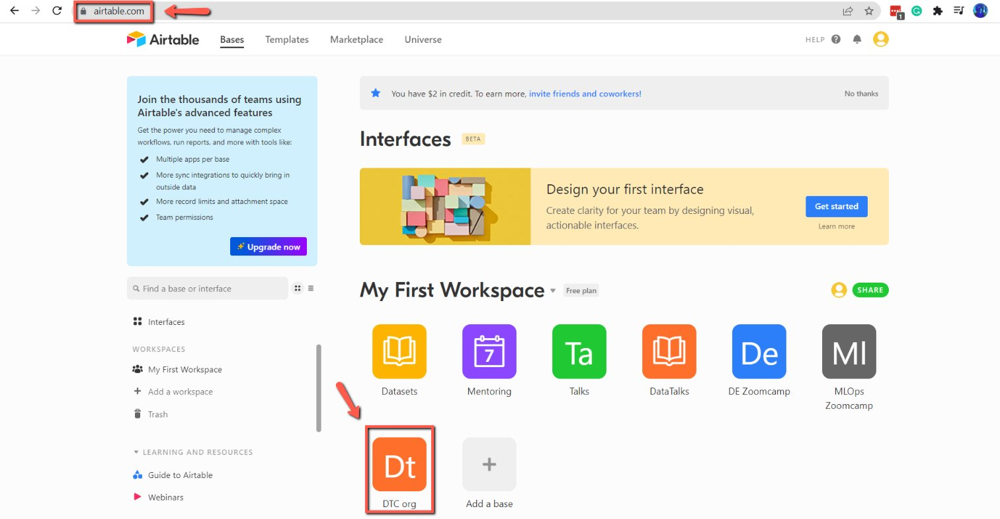
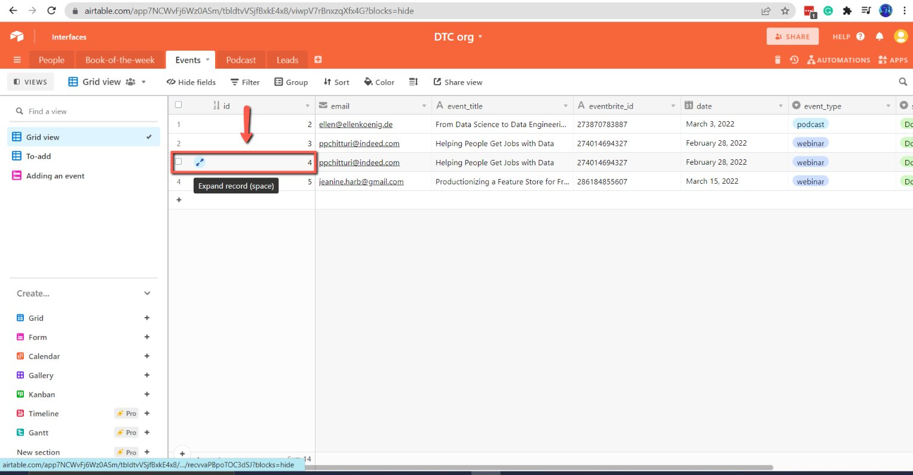
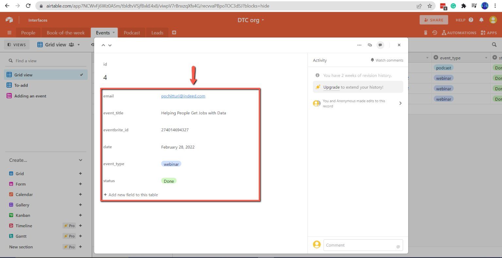
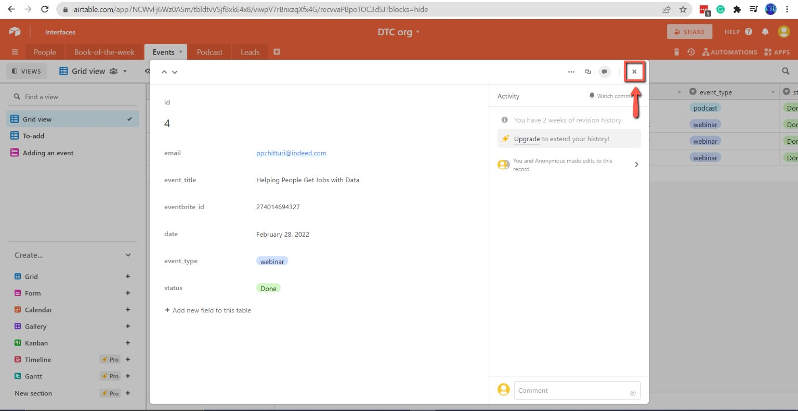

# Access and update the data on Airtable

<!-- sop-section-start: summary -->
## Summary

- Purpose: Correct or update event data already submitted to Airtable.
- Outcome: The Airtable record contains the corrected event title or fields.
- Trigger: Submitted event data is incorrect or needs a post-submission change.
- Frequency: As needed.
<!-- sop-section-end -->

<!-- sop-section-start: prerequisites -->
## Prerequisites

- Access: DataTalks.Club Airtable account.
- Tools: Airtable.
- Inputs: Event record and corrected event details.
<!-- sop-section-end -->

<!-- sop-section-start: procedure -->
## Procedure

<!-- sop-prose-start -->
How to Access and Change an Event Title on Airtable
This document shows the steps to Access and Change an Event Title on Airtable.

Step-by-step Instructions
<!-- sop-prose-end -->

<!-- sop-step-start id=1 -->
1.  The first thing you need to do is open [DataTalksClub Airtable](https://airtable.com/app0jPi5287VYvrii/tblDliCMPWs89MkMg/viwToYT0KdraUpK8t?blocks=hide) and select “DTC.org”

    Note: Make sure that you are logged with the DataTalks.Club's account.

    <!-- sop-screenshot-start -->
    
    <!-- sop-caption-start -->
    The screenshot shows the DataTalks.Club Airtable workspace with the DTC.org base selected. It helps confirm you are updating records in the shared DTC base rather than a personal or unrelated workspace.
    <!-- sop-caption-end -->
    <!-- sop-screenshot-end -->
<!-- sop-step-end -->

<!-- sop-step-start id=2 -->
2.  To edit the form, click on the expand icon right beside the event.

    <!-- sop-screenshot-start -->
    
    <!-- sop-caption-start -->
    The screenshot points to the expand control beside an event row. Use it to open the full Airtable record before editing the event fields.
    <!-- sop-caption-end -->
    <!-- sop-screenshot-end -->
<!-- sop-step-end -->

<!-- sop-step-start id=3 -->
3.  And now, edit the data of the event.

    Note: Make sure to follow the proper format and spaces.

    <!-- sop-screenshot-start -->
    
    <!-- sop-caption-start -->
    The screenshot shows the expanded Airtable event record with editable fields. It clarifies where the event data is changed and where formatting needs to be checked.
    <!-- sop-caption-end -->
    <!-- sop-screenshot-end -->
<!-- sop-step-end -->

<!-- sop-step-start id=4 -->
4.  Once done, click on the "X" icon on the top right of your screen. To close the window.

    <!-- sop-screenshot-start -->
    
    <!-- sop-caption-start -->
    The screenshot shows the close icon on the expanded Airtable record. Closing this panel returns you to the table after the event updates are saved.
    <!-- sop-caption-end -->
    <!-- sop-screenshot-end -->
<!-- sop-step-end -->
<!-- sop-section-end -->

<!-- sop-section-start: validation -->
## Validation

-
<!-- sop-section-end -->

<!-- sop-section-start: troubleshooting -->
## Troubleshooting

-
<!-- sop-section-end -->

<!-- sop-section-start: references -->
## References

-
<!-- sop-section-end -->
