# Creating Dashboards for Airtable

<!-- sop-section-start: summary -->
## Summary

- Purpose: Create Airtable dashboards for course registration tables.
- Outcome: An Airtable interface shows the registration count for a course.
- Trigger: A course base needs a simple registration dashboard.
- Frequency: Once per course base.
<!-- sop-section-end -->

<!-- sop-section-start: prerequisites -->
## Prerequisites

- Access: Airtable course base.
- Tools: Airtable Interfaces.
- Inputs: Course registration table and dashboard name.
<!-- sop-section-end -->

<!-- sop-section-start: procedure -->
## Procedure

<!-- sop-prose-start -->
How to Create Dashboards for Airtable
This document shows the steps on How to Create Dashboards for Airtable.

Step-by-step Instructions
<!-- sop-prose-end -->

<!-- sop-step-start id=1 -->
1.  First, go to the database you are interested in.

    Note: In this process, we will be creating a “MLOps Zoomcamp” dashboard.

    <!-- sop-screenshot-start -->
    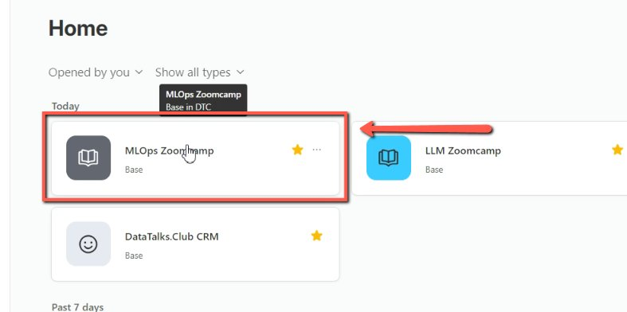
    <!-- sop-caption-start -->
    The screenshot shows the selected Airtable base for the course dashboard. It helps confirm you are starting from the correct course database before opening interface tools.
    <!-- sop-caption-end -->
    <!-- sop-screenshot-end -->
<!-- sop-step-end -->

<!-- sop-step-start id=2 -->
2.  Then, go to “Interfaces”.

    <!-- sop-screenshot-start -->
    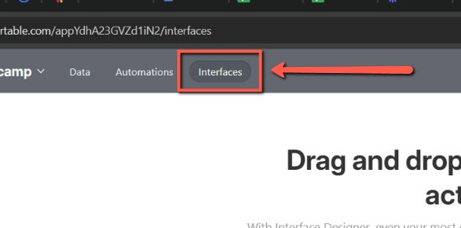
    <!-- sop-caption-start -->
    The screenshot shows the Interfaces entry in Airtable. This is the workspace area used to build dashboards on top of table data.
    <!-- sop-caption-end -->
    <!-- sop-screenshot-end -->
<!-- sop-step-end -->

<!-- sop-step-start id=3 -->
3.  After which, click on “Start Building”.

    <!-- sop-screenshot-start -->
    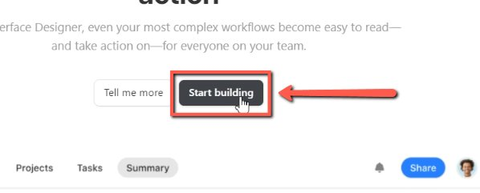
    <!-- sop-caption-start -->
    The screenshot shows the Start Building button for a new Airtable interface. It marks the point where dashboard setup begins.
    <!-- sop-caption-end -->
    <!-- sop-screenshot-end -->
<!-- sop-step-end -->

<!-- sop-step-start id=4 -->
4.  After, click on “Build an Interface”.

    <!-- sop-screenshot-start -->
    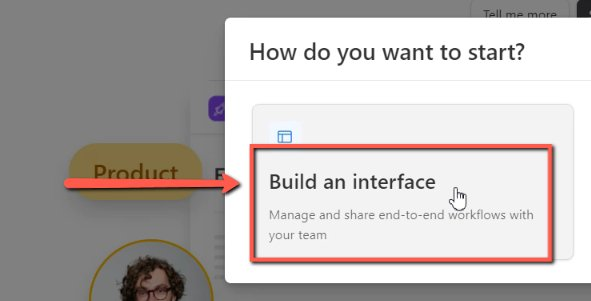
    <!-- sop-caption-start -->
    The screenshot shows the Build an Interface option. Choosing it starts the interface builder rather than a different Airtable view.
    <!-- sop-caption-end -->
    <!-- sop-screenshot-end -->
<!-- sop-step-end -->

<!-- sop-step-start id=5 -->
5.  Upon clicking, name the interface according to preference.

    <!-- sop-screenshot-start -->
    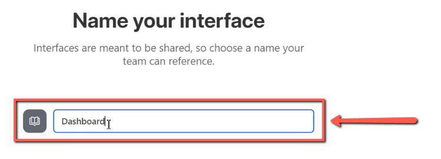
    <!-- sop-caption-start -->
    The screenshot shows the interface naming step. Use this field to give the dashboard a recognizable course or cohort name.
    <!-- sop-caption-end -->
    <!-- sop-screenshot-end -->
<!-- sop-step-end -->

<!-- sop-step-start id=6 -->
6.  Then, click on “Dashboard”.

    <!-- sop-screenshot-start -->
    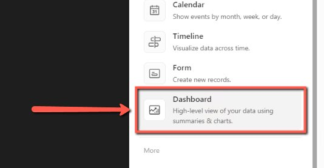
    <!-- sop-caption-start -->
    The screenshot shows the Dashboard layout option in Airtable Interfaces. Selecting it creates a dashboard-style interface for registration metrics.
    <!-- sop-caption-end -->
    <!-- sop-screenshot-end -->
<!-- sop-step-end -->

<!-- sop-step-start id=7 -->
7.  To proceed, click on “Next”.

    <!-- sop-screenshot-start -->
    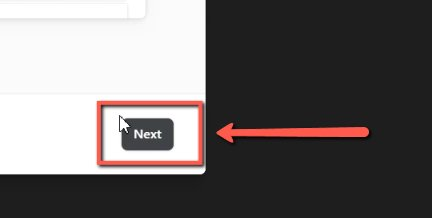
    <!-- sop-caption-start -->
    The screenshot shows the Next button after choosing the dashboard layout. This advances to the table selection step.
    <!-- sop-caption-end -->
    <!-- sop-screenshot-end -->
<!-- sop-step-end -->

<!-- sop-step-start id=8 -->
8.  On the Table options, select a Table name and click “Finish”.

    <!-- sop-screenshot-start -->
    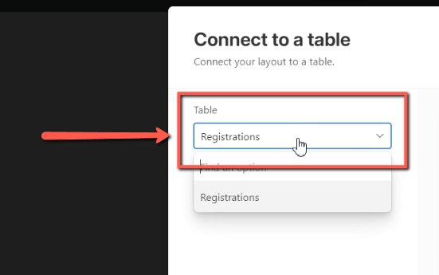
    <!-- sop-caption-start -->
    The screenshot shows the table picker and Finish button. It confirms which Airtable table will supply data to the dashboard.
    <!-- sop-caption-end -->
    <!-- sop-screenshot-end -->
<!-- sop-step-end -->

<!-- sop-step-start id=9 -->
9.  Then, customize the Dashboard.

    <!-- sop-screenshot-start -->
    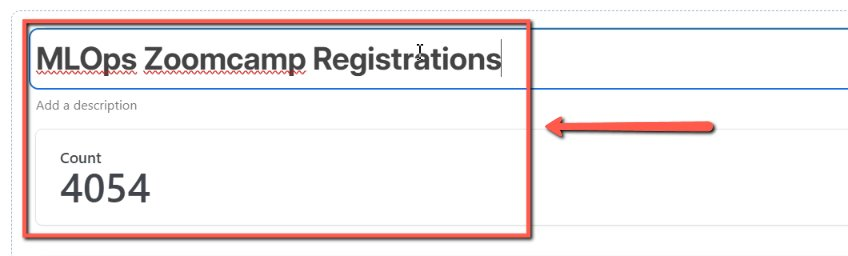
    <!-- sop-caption-start -->
    The screenshot shows the dashboard editor with configurable elements. This is where the dashboard can be adjusted before it is shared.
    <!-- sop-caption-end -->
    <!-- sop-screenshot-end -->
<!-- sop-step-end -->

<!-- sop-step-start id=10 -->
10. After customizing, click on “Publish”.

    <!-- sop-screenshot-start -->
    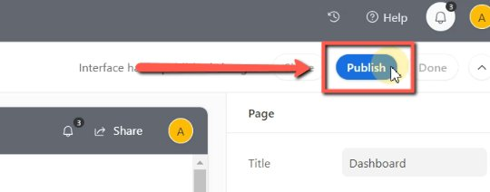
    <!-- sop-caption-start -->
    The screenshot shows the Publish control for the Airtable interface. Publishing makes the customized dashboard available to viewers.
    <!-- sop-caption-end -->
    <!-- sop-screenshot-end -->
<!-- sop-step-end -->

<!-- sop-step-start id=11 -->
11. To share, fill in the necessary information.

    <!-- sop-screenshot-start -->
    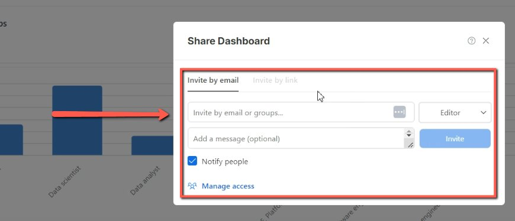
    <!-- sop-caption-start -->
    The screenshot shows the sharing dialog for the published dashboard. It indicates where to enter access details before sending or saving the share settings.
    <!-- sop-caption-end -->
    <!-- sop-screenshot-end -->
<!-- sop-step-end -->
<!-- sop-section-end -->

<!-- sop-section-start: validation -->
## Validation

-
<!-- sop-section-end -->

<!-- sop-section-start: troubleshooting -->
## Troubleshooting

-
<!-- sop-section-end -->

<!-- sop-section-start: references -->
## References

-
<!-- sop-section-end -->
