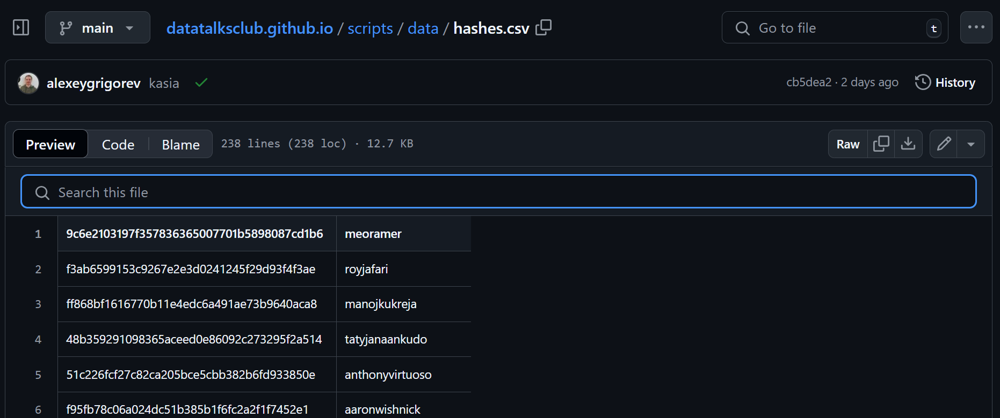
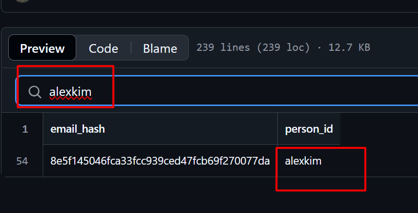
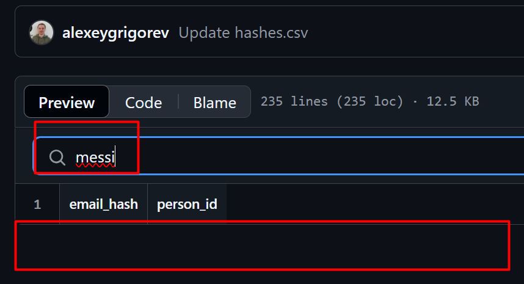
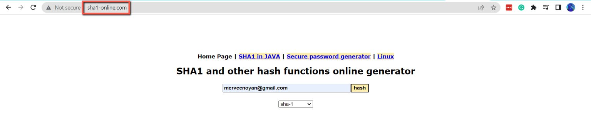
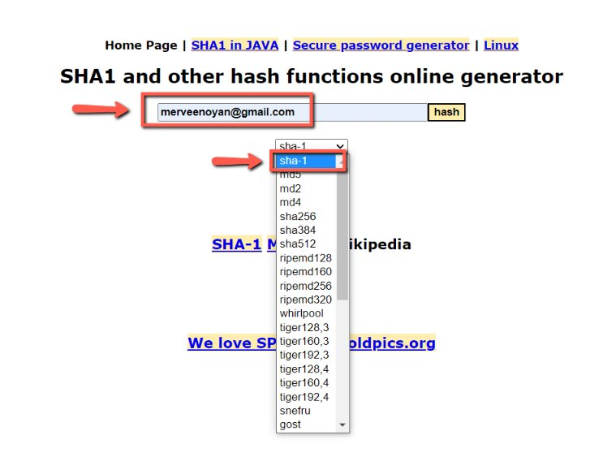
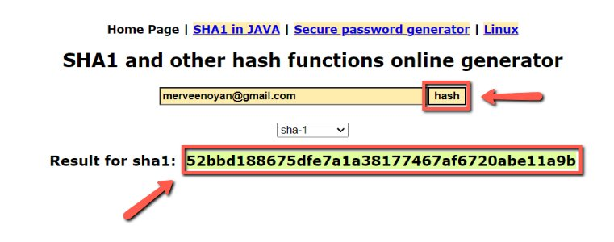
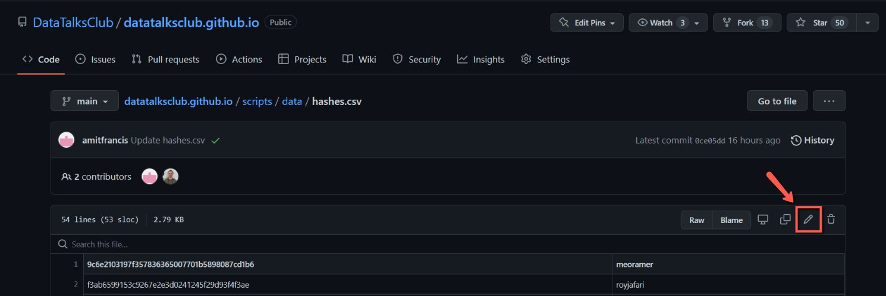
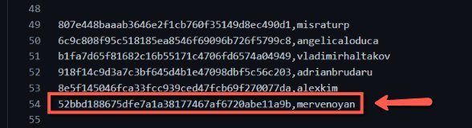
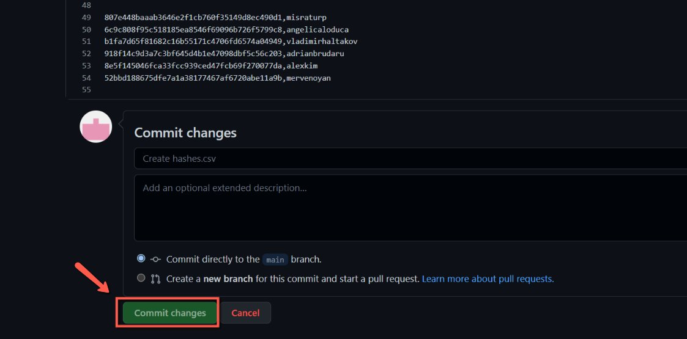

# Add email for people who are already on the website

<!-- sop-section-start: summary -->
## Summary

- Purpose: adding people’s email addresses to our website database
- Outcome: sometimes it happens that we have invited somebody previously to our events, but it was some time ago, so we don’t have their email address in our database. We need to save it, because next steps (e.g. adding the event to our website) depend on it.
- Trigger: before we fill in the “people” form to add a new person to our website (see [Create speaker profiles in Airtable](https://docs.google.com/document/d/1PaX3fYo7grHvQ2d7Mw1LBXZidJmFXqJ6ttk-DUeLNXM/edit))
- Frequency: As needed per person.
<!-- sop-section-end -->

<!-- sop-section-start: prerequisites -->
## Prerequisites

- Access: Website repository and Airtable person records.
- Tools: GitHub, SHA-1 hash generator, Airtable.
- Inputs: Person email and website profile ID.
<!-- sop-section-end -->

<!-- sop-section-start: procedure -->
## Procedure

<!-- sop-group-start: "Checking if we already have the guest in our database" -->
### Checking if we already have the guest in our database

<!-- sop-step-start id=1 -->
1.  Open the [hashes.csv file](https://github.com/DataTalksClub/datatalksclub.github.io/edit/main/scripts/data/hashes.csv) in our [DataTalks.Club’s GitHub repository](https://github.com/DataTalksClub/datatalksclub.github.io).

    This document contains the emails of our guests hashed for security (we don’t want to publish their email in public)

    <!-- sop-screenshot-start -->
    
    <!-- sop-caption-start -->
    The screenshot shows `scripts/data/hashes.csv` opened in the DataTalks.Club website repository. This file stores email hashes next to person IDs without exposing raw email addresses.
    <!-- sop-caption-end -->
    <!-- sop-screenshot-end -->
<!-- sop-step-end -->

<!-- sop-step-start id=2 -->
2.  Check if the person we want to add already exists by typing their ID in the search field.

    To find their ID, refer to this document: [Check if a person already exists on our website and find their ID](../../events/planning/sops/check-if-a-person-already-exists-on-our-website-and-find-their-id.md)

    Example when a person already exists in our database:

    <!-- sop-screenshot-start -->
    
    <!-- sop-caption-start -->
    The screenshot shows a successful search result in `hashes.csv` for an existing person ID. If the ID is already present, no new hash entry is needed.
    <!-- sop-caption-end -->
    <!-- sop-screenshot-end -->

    Example when a person doesn’t exist yet:

    <!-- sop-screenshot-start -->
    
    <!-- sop-caption-start -->
    The screenshot shows the same search when no matching person ID is found in `hashes.csv`. That empty result means you should continue with generating and adding the email hash.
    <!-- sop-caption-end -->
    <!-- sop-screenshot-end -->

    If the person is already there, don’t do anything – stop this process and continue with the github actions for adding the event to our website.

    If they don’t exist in our database, proceed further with this process document.
<!-- sop-step-end -->

<!-- sop-group-end -->

<!-- sop-group-start: "Getting the email hash" -->
### Getting the email hash

<!-- sop-step-start id=3 -->
3.  To compute the hash of the guest’s email, visit [http://www.sha1-online.com/](http://www.sha1-online.com/)

    <!-- sop-screenshot-start -->
    
    <!-- sop-caption-start -->
    The screenshot shows the SHA-1 generator site used to convert a guest email into a hash. This is the external tool used before editing `hashes.csv`.
    <!-- sop-caption-end -->
    <!-- sop-screenshot-end -->
<!-- sop-step-end -->

<!-- sop-step-start id=4 -->
4.  After, enter the email of the speaker and make sure that the drag-down button is on “sha-1”

    Note: Make sure that all letters of the email are in lower case and there should no spaces.

    <!-- sop-screenshot-start -->
    
    <!-- sop-caption-start -->
    The screenshot shows the email input and algorithm dropdown set to “sha-1”. Confirm the email is lowercase and the hash type is correct before generating the value.
    <!-- sop-caption-end -->
    <!-- sop-screenshot-end -->
<!-- sop-step-end -->

<!-- sop-step-start id=5 -->
5.  Once done, click “hash” and copy the result for sha1

    <!-- sop-screenshot-start -->
    
    <!-- sop-caption-start -->
    The screenshot shows the generated SHA-1 output after clicking “hash”. Copy this result exactly for the new `hashes.csv` line.
    <!-- sop-caption-end -->
    <!-- sop-screenshot-end -->
<!-- sop-step-end -->

<!-- sop-group-end -->

<!-- sop-group-start: "Adding the guest – editing the hashes.csv file" -->
### Adding the guest – editing the hashes.csv file

<!-- sop-step-start id=6 -->
6.  But if they are not, click on the pen edit tool icon.

    <!-- sop-screenshot-start -->
    
    <!-- sop-caption-start -->
    The screenshot shows the GitHub edit pencil for `scripts/data/hashes.csv`. Use it only after confirming the person ID is missing from the file.
    <!-- sop-caption-end -->
    <!-- sop-screenshot-end -->
<!-- sop-step-end -->

<!-- sop-step-start id=7 -->
7.  Paste the copied hash with the name of the speaker’s ID at the end of the files

    Very important: Add a line break after the last hash code. You should see that the next line is empty - in this particular example, the line 55 is there, but there’s nothing.

    <!-- sop-screenshot-start -->
    
    <!-- sop-caption-start -->
    The screenshot shows the new hash and person ID added at the end of `hashes.csv` with an empty line after it. That final blank line keeps the CSV formatted correctly for the website scripts.
    <!-- sop-caption-end -->
    <!-- sop-screenshot-end -->
<!-- sop-step-end -->

<!-- sop-step-start id=8 -->
8.  Once done, select “Commit changes”

    <!-- sop-screenshot-start -->
    
    <!-- sop-caption-start -->
    The screenshot shows the GitHub “Commit changes” action for saving the updated hash file. Committing this edit makes the new person email hash available to the website workflow.
    <!-- sop-caption-end -->
    <!-- sop-screenshot-end -->
<!-- sop-step-end -->

<!-- sop-step-start id=9 -->
9.  After that, you can run the github actions for adding people to the website from the form
<!-- sop-step-end -->

<!-- sop-group-end -->
<!-- sop-section-end -->

<!-- sop-section-start: validation -->
## Validation

-
<!-- sop-section-end -->

<!-- sop-section-start: troubleshooting -->
## Troubleshooting

-
<!-- sop-section-end -->

<!-- sop-section-start: references -->
## References

-
<!-- sop-section-end -->
