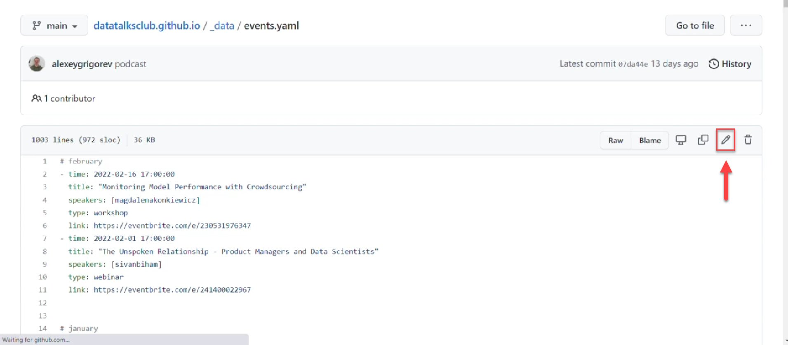
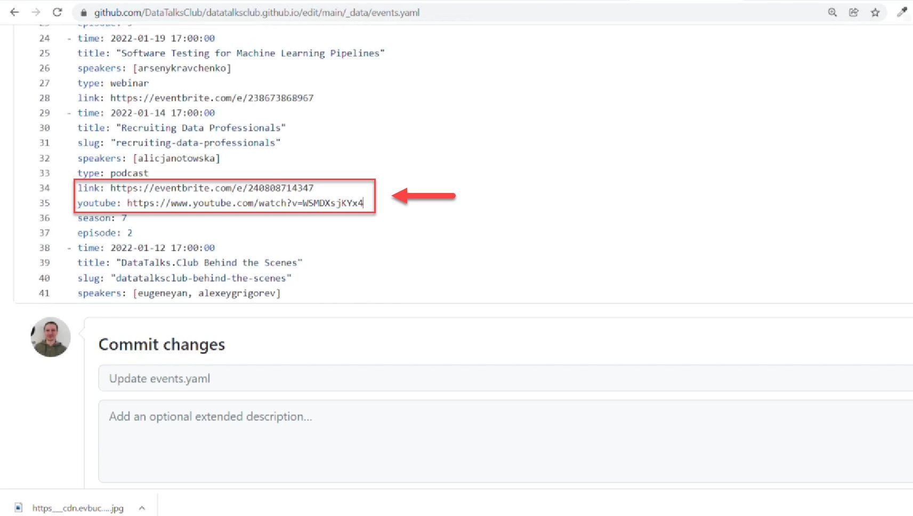
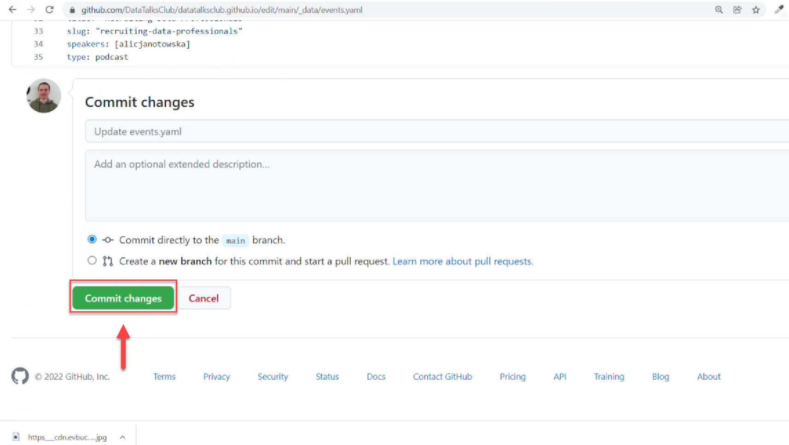

# Add the link of the stream to the website

<!-- sop-section-start: summary -->
## Summary

- Purpose: Adding the YouTube link of a past stream to our website
- Outcome: We want people to watch the events after they happened
- Trigger: After the live stream
- Frequency: Per event stream.
<!-- sop-section-end -->

<!-- sop-section-start: prerequisites -->
## Prerequisites

- Access: Website repository.
- Tools: GitHub.
- Inputs: Stream link and target website section.
<!-- sop-section-end -->

<!-- sop-section-start: procedure -->
## Procedure

<!-- sop-step-start id=1 -->
1.  Open [datatalksclub.github.io/\_data/events.yaml](https://github.com/DataTalksClub/datatalksclub.github.io/blob/main/_data/events.yaml) on GitHub
<!-- sop-step-end -->

<!-- sop-step-start id=2 -->
2.  Next, click on the pen tool icon on the right side of your screen to edit the document

    <!-- sop-screenshot-start -->
    
    <!-- sop-caption-start -->
    The screenshot shows the edit control for `_data/events.yaml` in the GitHub web UI. Use it to confirm you are editing the event data file, not just viewing it.
    <!-- sop-caption-end -->
    <!-- sop-screenshot-end -->
<!-- sop-step-end -->

<!-- sop-step-start id=3 -->
3.  After clicking, find the title of the event
    For example, for “Using Data to Create Liveable Cities” this is how the record in the file looks like:

    \- time: 2024-09-02 12:30:00

    title: "Using Data to Create Liveable Cities"

    speakers: \[rachellim\]

    type: podcast

    link: https://lu.ma/l3i43o1e
<!-- sop-step-end -->

<!-- sop-step-start id=4 -->
4.  Under "link:..." create a line break with the format: "youtube: \*insert link\*"

    Example of the result:

    \- time: 2024-09-02 12:30:00

    title: "Using Data to Create Liveable Cities"

    speakers: \[rachellim\]

    type: podcast

    link: https://lu.ma/l3i43o1e

    youtube: https://www.youtube.com/watch?v=VXQIGHUWeL0

    Note: Don't include the ampersand (&) and time of the video in pasting the link. e.g

    youtube.com/watch?v=afasfas&t=3s, don't include "&t=3s"

    <!-- sop-screenshot-start -->
    
    <!-- sop-caption-start -->
    The screenshot highlights the timestamp portion of a YouTube URL that should not be copied into the `youtube:` field. The website entry should keep only the base watch link.
    <!-- sop-caption-end -->
    <!-- sop-screenshot-end -->

    Examples of not correct links:

    - [https://youtube.com/watch?v=0Fx5PCoLkf4&t=3s](https://youtube.com/watch?v=afasfas&t=3s)

    - [https://youtu.be/0Fx5PCoLkf4](https://youtu.be/0Fx5PCoLkf4)

    Examples of correct links:

    - [https://youtube.com/watch?v=0Fx5PCoLkf4](https://youtube.com/watch?v=afasfas&t=3s)

    In addition to copying a correct YouTube link, remove the “&s=3s” or lines that follow an ampersand and the time of the video.
<!-- sop-step-end -->

<!-- sop-step-start id=5 -->
5.  Lastly, click "Commit changes"

    <!-- sop-screenshot-start -->
    
    <!-- sop-caption-start -->
    The screenshot shows GitHub's “Commit changes” button after editing `events.yaml`. This is the save point that submits the stream link update to the repository.
    <!-- sop-caption-end -->
    <!-- sop-screenshot-end -->
<!-- sop-step-end -->
<!-- sop-section-end -->

<!-- sop-section-start: validation -->
## Validation

-
<!-- sop-section-end -->

<!-- sop-section-start: troubleshooting -->
## Troubleshooting

-
<!-- sop-section-end -->

<!-- sop-section-start: references -->
## References

-
<!-- sop-section-end -->
