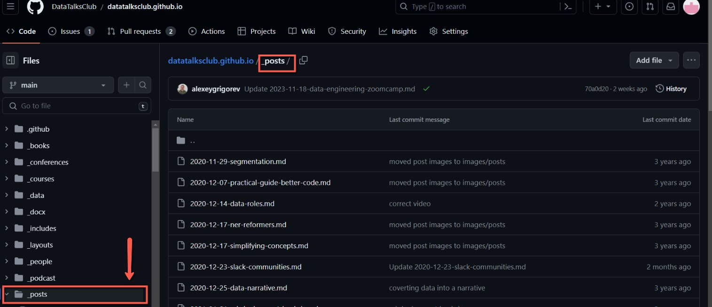
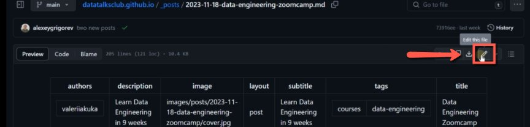
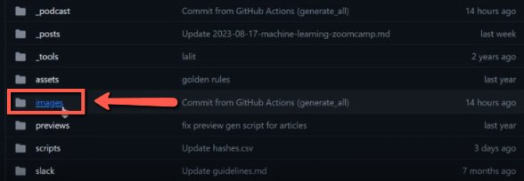
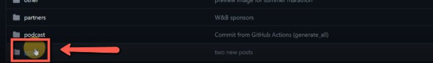
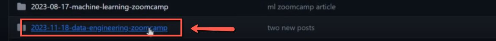
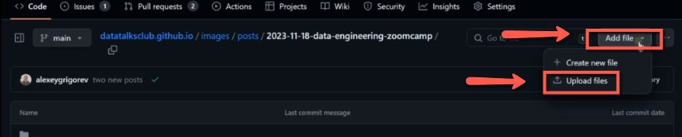
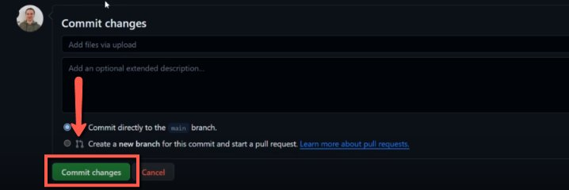
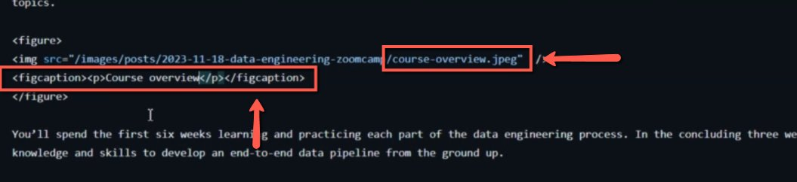
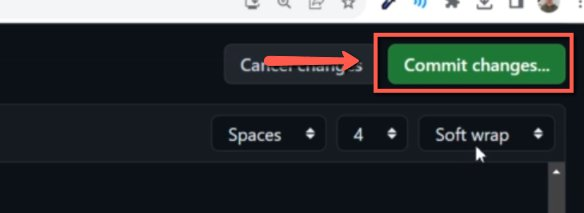

# Adding Images to Articles on Our Website

<!-- sop-section-start: summary -->
## Summary

- Purpose: Add or replace images in website articles.
- Outcome: The article references uploaded image files and the site rebuilds successfully.
- Trigger: An article needs a new or updated image.
- Frequency: As needed per article.
<!-- sop-section-end -->

<!-- sop-section-start: prerequisites -->
## Prerequisites

- Access: Website GitHub repository.
- Tools: GitHub, website build actions.
- Inputs: Article file, image file, image path, and caption.
<!-- sop-section-end -->

<!-- sop-section-start: procedure -->
## Procedure

<!-- sop-prose-start -->
How to Add Images to Articles on our Website
This procedure will show you the steps on howt o Add Images to Articles on our Website

Step-by-step Instructions
<!-- sop-prose-end -->

<!-- sop-step-start id=1 -->
1.  The first thing you need to do is Access the [Github repository](https://github.com/DataTalksClub/datatalksclub.github.io/tree/main/_posts)

    <!-- sop-screenshot-start -->
    
    <!-- sop-caption-start -->
    The screenshot shows the website repository opened at the `_posts` directory. This is where article markdown files are located before adding or updating image references.
    <!-- sop-caption-end -->
    <!-- sop-screenshot-end -->
<!-- sop-step-end -->

<!-- sop-step-start id=2 -->
2.  And then, locate the article

    <!-- sop-screenshot-start -->
    
    <!-- sop-caption-start -->
    The screenshot shows the article list in `_posts` so you can select the markdown file that needs the image update. Confirm the filename matches the target article before editing.
    <!-- sop-caption-end -->
    <!-- sop-screenshot-end -->
<!-- sop-step-end -->

<!-- sop-step-start id=3 -->
3.  And then, click on the edit icon

    <!-- sop-screenshot-start -->
    
    <!-- sop-caption-start -->
    The screenshot shows the GitHub edit pencil for the selected article file. This opens the markdown editor where the image URL and figure title will be added.
    <!-- sop-caption-end -->
    <!-- sop-screenshot-end -->
<!-- sop-step-end -->

<!-- sop-step-start id=4 -->
4.  After, go the the “images” file on Github

    <!-- sop-screenshot-start -->
    
    <!-- sop-caption-start -->
    The screenshot shows the repository root with the `images` directory. Article assets need to be uploaded there so the website can serve them.
    <!-- sop-caption-end -->
    <!-- sop-screenshot-end -->

    And then, go to “posts”
    <!-- sop-screenshot-start -->
    
    <!-- sop-caption-start -->
    The screenshot shows the `images/posts` folder in GitHub. This folder groups images used by website posts and articles.
    <!-- sop-caption-end -->
    <!-- sop-screenshot-end -->

    After, go to the location of the image
    <!-- sop-screenshot-start -->
    
    <!-- sop-caption-start -->
    The screenshot shows the destination subfolder for the article image inside `images/posts`. Uploading to the matching folder keeps the image path consistent with the article.
    <!-- sop-caption-end -->
    <!-- sop-screenshot-end -->
<!-- sop-step-end -->

<!-- sop-step-start id=5 -->
5.  Click on the drop down button and select “Upload file”

    <!-- sop-screenshot-start -->
    
    <!-- sop-caption-start -->
    The screenshot shows GitHub's Add file menu with “Upload files” selected. Use this control to add the article image to the repository from your computer.
    <!-- sop-caption-end -->
    <!-- sop-screenshot-end -->
<!-- sop-step-end -->

<!-- sop-step-start id=6 -->
6.  Once done, click “Commit Changes”

    <!-- sop-screenshot-start -->
    
    <!-- sop-caption-start -->
    The screenshot shows the commit button for the uploaded image file. Committing here saves the new asset before you reference it from the article.
    <!-- sop-caption-end -->
    <!-- sop-screenshot-end -->
<!-- sop-step-end -->

<!-- sop-step-start id=7 -->
7.  After, click the file and click copy

    <!-- sop-screenshot-start -->
    
    <!-- sop-caption-start -->
    The screenshot shows the uploaded image file page where its repository path or URL can be copied. That copied value becomes the image reference in the markdown article.
    <!-- sop-caption-end -->
    <!-- sop-screenshot-end -->
<!-- sop-step-end -->

<!-- sop-step-start id=8 -->
8.  After clicking the edit icon on step number 3, paste the copied link of the image and and change the title of the figure in t

    <!-- sop-screenshot-start -->
    
    <!-- sop-caption-start -->
    The screenshot shows the article markdown editor with the image link and figure title being updated. This is where the uploaded asset is connected to the article content.
    <!-- sop-caption-end -->
    <!-- sop-screenshot-end -->
<!-- sop-step-end -->

<!-- sop-step-start id=9 -->
9.  Click “Commit Changes”

    <!-- sop-screenshot-start -->
    
    <!-- sop-caption-start -->
    The screenshot shows the final GitHub commit action for the edited article markdown. This saves the new image reference so the website build can include it.
    <!-- sop-caption-end -->
    <!-- sop-screenshot-end -->
<!-- sop-step-end -->
<!-- sop-section-end -->

<!-- sop-section-start: validation -->
## Validation

-
<!-- sop-section-end -->

<!-- sop-section-start: troubleshooting -->
## Troubleshooting

-
<!-- sop-section-end -->

<!-- sop-section-start: references -->
## References

-
<!-- sop-section-end -->
