# Debugging Process for Website Content

<!-- sop-section-start: summary -->
## Summary

- Purpose: Diagnose failed website content generation runs.
- Outcome: The problematic Airtable record is fixed and the workflow reruns successfully.
- Trigger: The website content workflow fails.
- Frequency: As needed.
<!-- sop-section-end -->

<!-- sop-section-start: prerequisites -->
## Prerequisites

- Access: Website GitHub Actions and content Airtable base.
- Tools: GitHub Actions, Airtable.
- Inputs: Failed workflow logs and affected Airtable records.
<!-- sop-section-end -->

<!-- sop-section-start: procedure -->
## Procedure

<!-- sop-prose-start -->
How to Debug Content for Website
In preparing and running content for the Website, specific errors occur at certain parts which need fixing to allow the smooth running of the website.

Step-by-step Instructions
<!-- sop-prose-end -->

<!-- sop-step-start id=1 -->
1.  First, open [https://github.com/DataTalksClub/datatalksclub.github.io/blob/main/\_data/events.yaml](https://github.com/DataTalksClub/datatalksclub.github.io/blob/main/_data/events.yaml) and then, click on “Actions” to view different workflow runs.

    <!-- sop-screenshot-start -->
    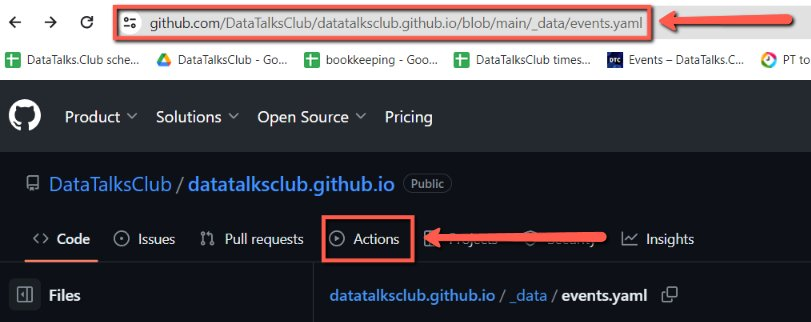
    <!-- sop-caption-start -->
    The screenshot shows the website repository header with the “Actions” tab available from the `events.yaml` page. That tab is where the content-generation workflow history is reviewed.
    <!-- sop-caption-end -->
    <!-- sop-screenshot-end -->
<!-- sop-step-end -->

<!-- sop-step-start id=2 -->
2.  To locate the error, click on “All workflows”.

    <!-- sop-screenshot-start -->
    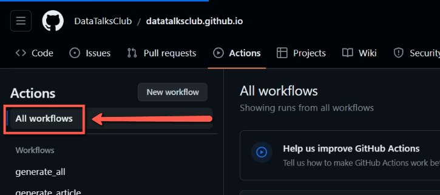
    <!-- sop-caption-start -->
    The screenshot shows the GitHub Actions sidebar with “All workflows” selected. This view lets you find the failed run before narrowing into a specific workflow.
    <!-- sop-caption-end -->
    <!-- sop-screenshot-end -->
<!-- sop-step-end -->

<!-- sop-step-start id=3 -->
3.  Under “All workflows”, click on the specific workflow that needs debugging.

    Note: A red “x” mark indicates a failed workflow run.

    <!-- sop-screenshot-start -->
    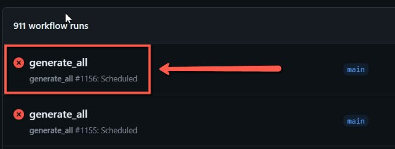
    <!-- sop-caption-start -->
    The screenshot shows the workflow run list where failed runs are marked with a red status icon. Pick the failing workflow from this list to inspect its logs.
    <!-- sop-caption-end -->
    <!-- sop-screenshot-end -->
<!-- sop-step-end -->

<!-- sop-step-start id=4 -->
4.  To view workflow source code, click on the “generate all” button.

    <!-- sop-screenshot-start -->
    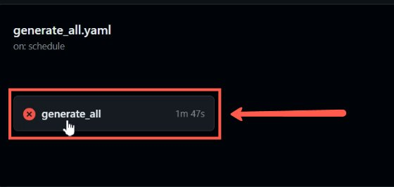
    <!-- sop-caption-start -->
    The screenshot shows the failed “generate all” run inside GitHub Actions. Opening that run exposes the jobs and log sections that identify the content error.
    <!-- sop-caption-end -->
    <!-- sop-screenshot-end -->
<!-- sop-step-end -->

<!-- sop-step-start id=5 -->
5.  After clicking, locate which part of the workflow has failed and click to view the code.

    <!-- sop-screenshot-start -->
    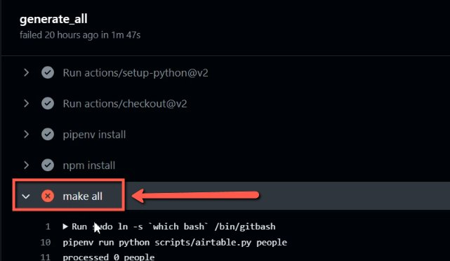
    <!-- sop-caption-start -->
    The screenshot shows the failed job section inside the workflow run. The red marker identifies the step whose logs need to be opened first.
    <!-- sop-caption-end -->
    <!-- sop-screenshot-end -->
<!-- sop-step-end -->

<!-- sop-step-start id=6 -->
6.  Then, run through the code and see which part the error occured.

    <!-- sop-screenshot-start -->
    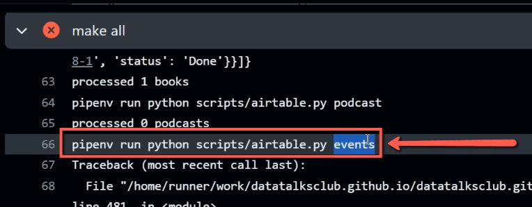
    <!-- sop-caption-start -->
    The screenshot shows the workflow log output where the error details appear. Use the failing log line to identify which content record or field needs attention.
    <!-- sop-caption-end -->
    <!-- sop-screenshot-end -->
<!-- sop-step-end -->

<!-- sop-step-start id=7 -->
7.  After locating the error, visit the website to check the error.

    <!-- sop-screenshot-start -->
    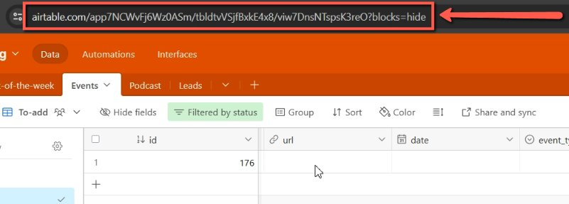
    <!-- sop-caption-start -->
    The screenshot shows the public website view used to confirm how the logged content problem appears to users. It connects the GitHub Actions error to the affected website section.
    <!-- sop-caption-end -->
    <!-- sop-screenshot-end -->
<!-- sop-step-end -->

<!-- sop-step-start id=8 -->
8.  After which, proceed to the section where the error is.

    Note: In here, error was found at the “Events” section of the Website.

    <!-- sop-screenshot-start -->
    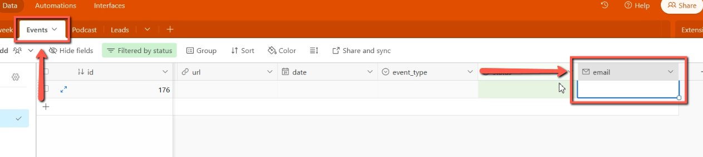
    <!-- sop-caption-start -->
    The screenshot shows the affected website content area, in this case the Events section. Use it to match the visible problem with the record that needs correction.
    <!-- sop-caption-end -->
    <!-- sop-screenshot-end -->
<!-- sop-step-end -->

<!-- sop-step-start id=9 -->
9.  Then, select the specific row, right-click and select “Delete record” to fix the error.

    Note: There are different ways of fixing errors, it only depends on the nature of the error. Some errors may require updating information in some columns.

    <!-- sop-screenshot-start -->
    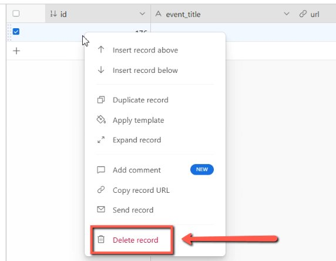
    <!-- sop-caption-start -->
    The screenshot shows the Airtable record context menu with “Delete record” available. This is the correction path when the failing content row should be removed instead of edited.
    <!-- sop-caption-end -->
    <!-- sop-screenshot-end -->
<!-- sop-step-end -->

<!-- sop-step-start id=10 -->
10. With the error being fixed, go back to the website repository and click on “Run workflow”.

    <!-- sop-screenshot-start -->
    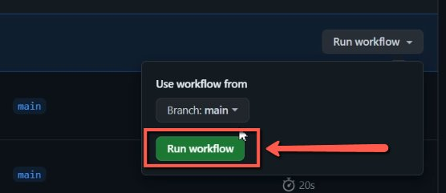
    <!-- sop-caption-start -->
    The screenshot shows the GitHub Actions “Run workflow” control after the Airtable fix. Rerunning the workflow regenerates the website content from the corrected data.
    <!-- sop-caption-end -->
    <!-- sop-screenshot-end -->
<!-- sop-step-end -->

<!-- sop-step-start id=11 -->
11. After, wait for the workflow to run.

    Note: An “orange circle” on the right side of the text indicates a running workflow. It may take a few minutes to complete the run.

    <!-- sop-screenshot-start -->
    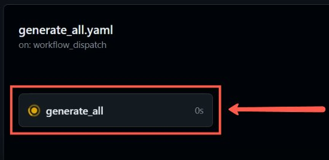
    <!-- sop-caption-start -->
    The screenshot shows the workflow in progress with a running status indicator. Wait here until the run finishes before checking whether the fix worked.
    <!-- sop-caption-end -->
    <!-- sop-screenshot-end -->
<!-- sop-step-end -->

<!-- sop-step-start id=12 -->
12. After a successful run, check on the workflow code to see if the error has been completely fixed.

    Note: A “green checkmark” indicates a successful run of the workflow.

    <!-- sop-screenshot-start -->
    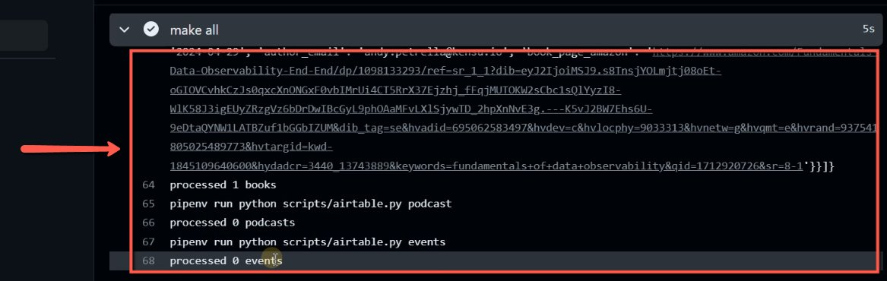
    <!-- sop-caption-start -->
    The screenshot shows a completed GitHub Actions run with a green success status. This confirms the regenerated website content no longer fails at the workflow level.
    <!-- sop-caption-end -->
    <!-- sop-screenshot-end -->

    <!-- sop-screenshot-start -->
    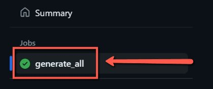
    <!-- sop-caption-start -->
    The screenshot shows the successful job details after reopening the workflow run. Use it to verify the previously failing step now completes cleanly.
    <!-- sop-caption-end -->
    <!-- sop-screenshot-end -->
<!-- sop-step-end -->
<!-- sop-section-end -->

<!-- sop-section-start: validation -->
## Validation

-
<!-- sop-section-end -->

<!-- sop-section-start: troubleshooting -->
## Troubleshooting

-
<!-- sop-section-end -->

<!-- sop-section-start: references -->
## References

-
<!-- sop-section-end -->
