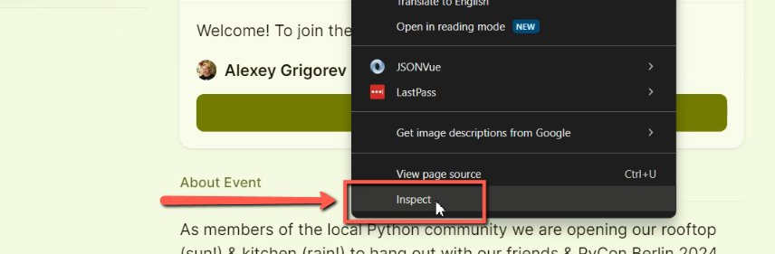
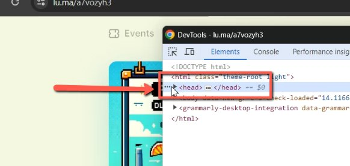
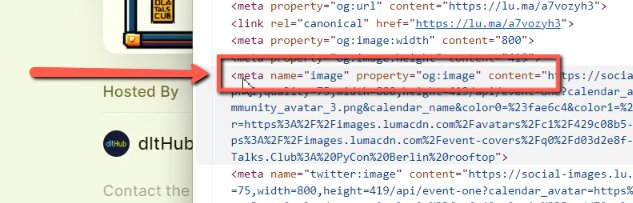
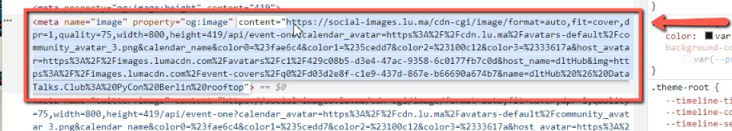
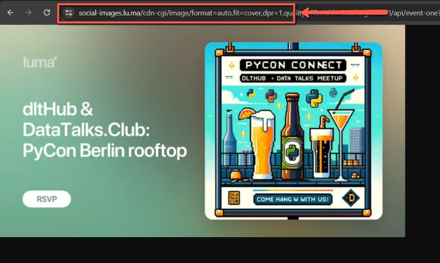
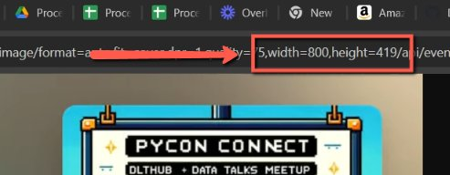

# Extracting Images from Websites

<!-- sop-section-start: summary -->
## Summary

- Purpose: Extract preview images from web pages for reuse.
- Outcome: A direct image URL is available, optionally resized when the source supports it.
- Trigger: A page preview image is needed for event or website content.
- Frequency: As needed.
<!-- sop-section-end -->

<!-- sop-section-start: prerequisites -->
## Prerequisites

- Access: Source web page.
- Tools: Chrome DevTools.
- Inputs: Page URL and desired image size.
<!-- sop-section-end -->

<!-- sop-section-start: procedure -->
## Procedure

<!-- sop-prose-start -->
How to Extract Images from Websites
This document shows the steps on How to Extract Images from Websites.

Step-by-step Instructions
<!-- sop-prose-end -->

<!-- sop-step-start id=1 -->
1.  After opening the website, right-click and select “Inspect”.

    <!-- sop-screenshot-start -->
    
    <!-- sop-caption-start -->
    The screenshot shows the browser context menu with “Inspect” selected on the source page. This opens DevTools so you can find the page's preview image metadata.
    <!-- sop-caption-end -->
    <!-- sop-screenshot-end -->
<!-- sop-step-end -->

<!-- sop-step-start id=2 -->
2.  Then, go to “\<head\>”.

    <!-- sop-screenshot-start -->
    
    <!-- sop-caption-start -->
    The screenshot shows the DevTools Elements panel focused on the page's `<head>` section. Preview image metadata is usually stored there rather than in the visible page body.
    <!-- sop-caption-end -->
    <!-- sop-screenshot-end -->
<!-- sop-step-end -->

<!-- sop-step-start id=3 -->
3.  Under \<head\>, locate for tech called \<meta name=”image” property=”og:image” content=”.

    <!-- sop-screenshot-start -->
    
    <!-- sop-caption-start -->
    The screenshot shows the `og:image` meta tag inside `<head>`. The `content` value is the direct image URL to copy for reuse.
    <!-- sop-caption-end -->
    <!-- sop-screenshot-end -->
<!-- sop-step-end -->

<!-- sop-step-start id=4 -->
4.  To proceed, double-click on the link.

    <!-- sop-screenshot-start -->
    
    <!-- sop-caption-start -->
    The screenshot shows the image URL selected in the meta tag's `content` attribute. Double-clicking helps capture the exact link without surrounding HTML.
    <!-- sop-caption-end -->
    <!-- sop-screenshot-end -->
<!-- sop-step-end -->

<!-- sop-step-start id=5 -->
5.  On another tab, paste the link on the address bar and enter to view image.

    <!-- sop-screenshot-start -->
    
    <!-- sop-caption-start -->
    The screenshot shows the copied `og:image` URL opened directly in a browser tab. This confirms the link returns the actual image file before you use it elsewhere.
    <!-- sop-caption-end -->
    <!-- sop-screenshot-end -->
<!-- sop-step-end -->

<!-- sop-step-start id=6 -->
6.  On the address bar, adjust the width and height according to preference.

    Note: This process is specific for Luma and will not work for other websites.

    <!-- sop-screenshot-start -->
    
    <!-- sop-caption-start -->
    The screenshot shows the Luma image URL with width and height parameters in the address bar. Adjust those values only when resizing a Luma-hosted image.
    <!-- sop-caption-end -->
    <!-- sop-screenshot-end -->
<!-- sop-step-end -->
<!-- sop-section-end -->

<!-- sop-section-start: validation -->
## Validation

-
<!-- sop-section-end -->

<!-- sop-section-start: troubleshooting -->
## Troubleshooting

-
<!-- sop-section-end -->

<!-- sop-section-start: references -->
## References

-
<!-- sop-section-end -->
