# Renaming Profile ID on the website

<!-- sop-section-start: summary -->
## Summary

- Purpose: Fix mismatched website person profile IDs.
- Outcome: Person file names, profile IDs, and image names match the event references.
- Trigger: A speaker profile does not resolve correctly on the website.
- Frequency: As needed.
<!-- sop-section-end -->

<!-- sop-section-start: prerequisites -->
## Prerequisites

- Access: Website GitHub repository.
- Tools: GitHub.
- Inputs: Existing person profile, expected person ID, and related image file.
<!-- sop-section-end -->

<!-- sop-section-start: procedure -->
## Procedure

<!-- sop-prose-start -->
How to Rename the Profile ID on the Website
There are instances where the name in the Profile ID does not match with what is shown on the URL of the website, file names for the images, and on some parts or there are some typographical errors.

Note: This is only for updating file names for existing profiles in the website. In cases where there is no existing profile, creating a new file is needed.

Step-by-step Instructions
<!-- sop-prose-end -->

<!-- sop-step-start id=1 -->
1.  First, visit datatalks.club/people to view the different profiles.

    <!-- sop-screenshot-start -->
    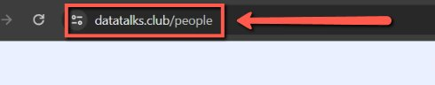
    <!-- sop-caption-start -->
    The screenshot shows the public `datatalks.club/people` directory where speaker profiles are listed. Start here to compare the visible profile name with the profile URL.
    <!-- sop-caption-end -->
    <!-- sop-screenshot-end -->
<!-- sop-step-end -->

<!-- sop-step-start id=2 -->
2.  Then, scroll through the list of names and click on the profile that needs editing.

    Note: In here, Tanya Berger-Wolf’s profile name does not match with what is shown on the URL of the website. Instead of Tanya Berger-Wolf, tanyawold is displayed.

    <!-- sop-screenshot-start -->
    
    <!-- sop-caption-start -->
    The screenshot shows Tanya Berger-Wolf's profile entry in the people list. It identifies the public profile that needs to be checked for an ID or URL mismatch.
    <!-- sop-caption-end -->
    <!-- sop-screenshot-end -->

    <!-- sop-screenshot-start -->
    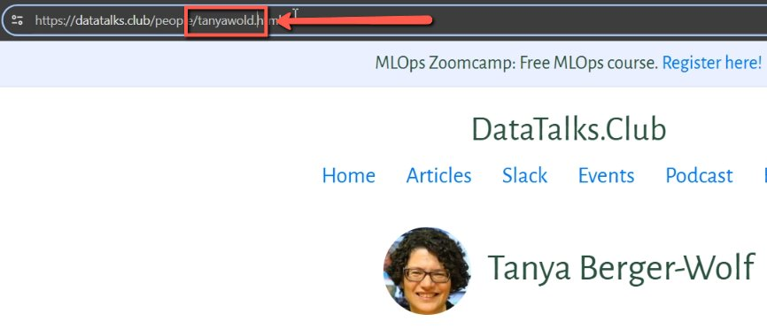
    <!-- sop-caption-start -->
    The screenshot shows the opened profile page where the URL does not match the displayed speaker name. This confirms the profile ID typo before changing repository files.
    <!-- sop-caption-end -->
    <!-- sop-screenshot-end -->
<!-- sop-step-end -->

<!-- sop-step-start id=3 -->
3.  After spotting the problem, visit the Website Repository ([https://github.com/DataTalksClub/datatalksclub.github.io](https://github.com/DataTalksClub/datatalksclub.github.io)) and click on “Code” then, “people”.

    <!-- sop-screenshot-start -->
    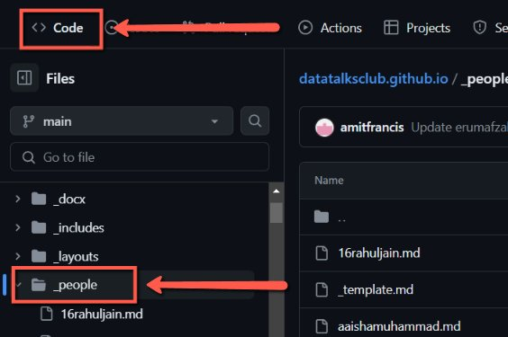
    <!-- sop-caption-start -->
    The screenshot shows the website repository's `people` directory in GitHub. This folder contains the person profile files that control website IDs and profile pages.
    <!-- sop-caption-end -->
    <!-- sop-screenshot-end -->
<!-- sop-step-end -->

<!-- sop-step-start id=4 -->
4.  After which, scroll through the different profile IDs and look for the ID that needs editing and click.

    <!-- sop-screenshot-start -->
    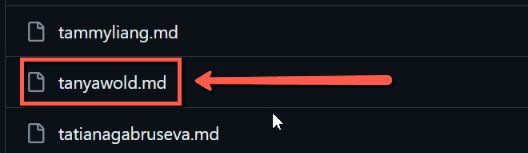
    <!-- sop-caption-start -->
    The screenshot shows the list of profile ID files in the `people` directory. Select the file whose ID matches the incorrect public URL.
    <!-- sop-caption-end -->
    <!-- sop-screenshot-end -->
<!-- sop-step-end -->

<!-- sop-step-start id=5 -->
5.  Then, click on “Edit this file” (pen icon) button on the top right corner of the screen.

    Note: In here, renaming is only done because we already have the profile of the person but in instances that we do not have an existing profile, creating a new file is needed.
    <!-- sop-screenshot-start -->
    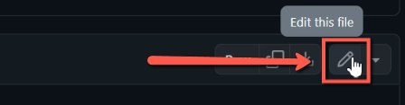
    <!-- sop-caption-start -->
    The screenshot shows the GitHub edit pencil on the selected person profile file. Opening the editor lets you fix mismatched fields such as `short`, `title`, or image references.
    <!-- sop-caption-end -->
    <!-- sop-screenshot-end -->
<!-- sop-step-end -->

<!-- sop-step-start id=6 -->
6.  After clicking, edit the details that showed errors.

    Note: In here, both the website URL and image file name have typographical errors and do not match with the “short” and “title” names.

    <!-- sop-screenshot-start -->
    
    <!-- sop-caption-start -->
    The screenshot shows the profile YAML fields being edited for the incorrect person ID. Use it to align the displayed title, short ID, and related filenames.
    <!-- sop-caption-end -->
    <!-- sop-screenshot-end -->

    <!-- sop-screenshot-start -->
    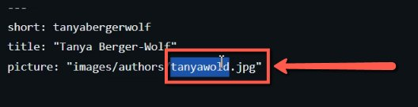
    <!-- sop-caption-start -->
    The screenshot shows the corrected profile details after the typo is fixed in GitHub's editor. Check that the values now match the intended speaker ID before committing.
    <!-- sop-caption-end -->
    <!-- sop-screenshot-end -->
<!-- sop-step-end -->

<!-- sop-step-start id=7 -->
7.  After doing all the necessary edits, click on “Commit changes” on the right side of the screen to save the edits.

    <!-- sop-screenshot-start -->
    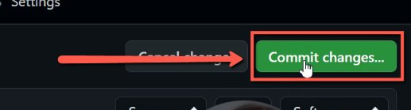
    <!-- sop-caption-start -->
    The screenshot shows the “Commit changes” button for the edited person profile file. This saves the profile ID corrections to the repository.
    <!-- sop-caption-end -->
    <!-- sop-screenshot-end -->
<!-- sop-step-end -->

<!-- sop-step-start id=8 -->
8.  Since the image file name showed errors, go back to “Code” and click on “images” to view the different image file names of the different accounts.

    <!-- sop-screenshot-start -->
    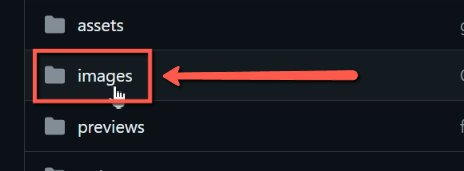
    <!-- sop-caption-start -->
    The screenshot shows the repository `images` directory after fixing the profile file. Use it to locate the author image whose filename also needs to match the corrected ID.
    <!-- sop-caption-end -->
    <!-- sop-screenshot-end -->
<!-- sop-step-end -->

<!-- sop-step-start id=9 -->
9.  Inside the “images” folder, scroll through the different sub-folders and click on “authors”.

    <!-- sop-screenshot-start -->
    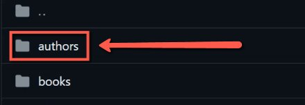
    <!-- sop-caption-start -->
    The screenshot shows the `images/authors` folder in GitHub. Author profile photos are stored here and should use filenames that match the person IDs.
    <!-- sop-caption-end -->
    <!-- sop-screenshot-end -->
<!-- sop-step-end -->

<!-- sop-step-start id=10 -->
10. Within the “authors” folder are the different images of each Profile in the website, scroll through the names and click on the file that needs editing.

    Note: As seen below, what is displayed is “tanyawold.jpg” instead of “tanyabergerwolf.jpg”.

    <!-- sop-screenshot-start -->
    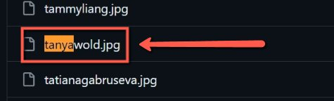
    <!-- sop-caption-start -->
    The screenshot shows the author image filenames, including the mistyped `tanyawold.jpg` example. Select the mismatched image file so its name can be corrected.
    <!-- sop-caption-end -->
    <!-- sop-screenshot-end -->
<!-- sop-step-end -->

<!-- sop-step-start id=11 -->
11. After, select the image and then, click “Edit this file” (pen icon) on the right side of the screen and make the necessary edits.

    <!-- sop-screenshot-start -->
    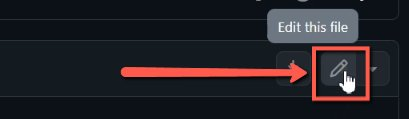
    <!-- sop-caption-start -->
    The screenshot shows the selected author image file with GitHub's edit control available. Use this when renaming or correcting the image file metadata in the repository UI.
    <!-- sop-caption-end -->
    <!-- sop-screenshot-end -->

    <!-- sop-screenshot-start -->
    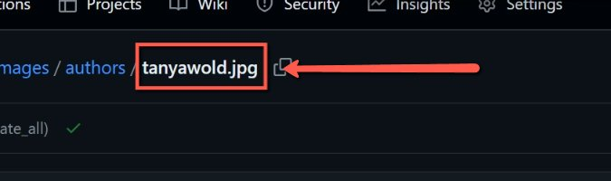
    <!-- sop-caption-start -->
    The screenshot shows the edit view for the author image filename after selecting the file. Confirm the new image name matches the corrected profile ID.
    <!-- sop-caption-end -->
    <!-- sop-screenshot-end -->
<!-- sop-step-end -->

<!-- sop-step-start id=12 -->
12. Then, click on “Commit changes” to save the edits made.

    Note: Double-check to see if all file names match with the Profile ID. Also, it may take some time for the edits to reflect on the website.

    <!-- sop-screenshot-start -->
    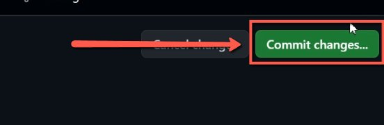
    <!-- sop-caption-start -->
    The screenshot shows the commit action for saving the author image filename change. This final commit keeps the profile file and image asset names in sync.
    <!-- sop-caption-end -->
    <!-- sop-screenshot-end -->
<!-- sop-step-end -->
<!-- sop-section-end -->

<!-- sop-section-start: validation -->
## Validation

-
<!-- sop-section-end -->

<!-- sop-section-start: troubleshooting -->
## Troubleshooting

-
<!-- sop-section-end -->

<!-- sop-section-start: references -->
## References

-
<!-- sop-section-end -->
