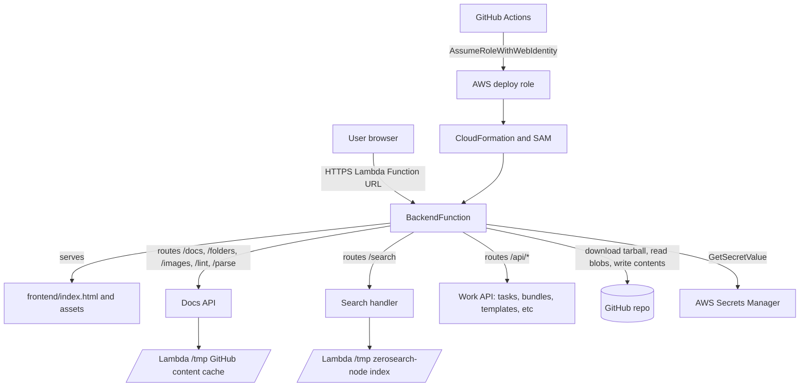
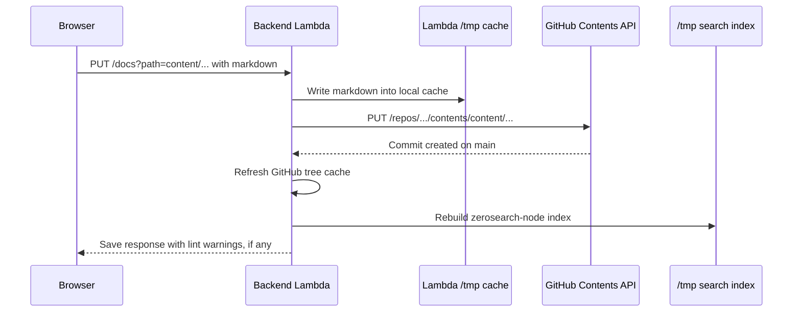
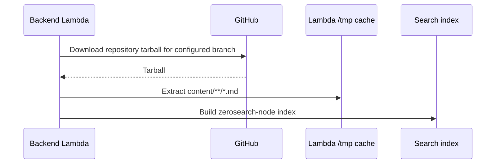
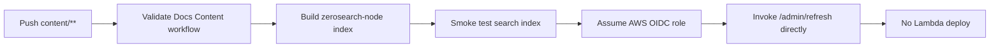
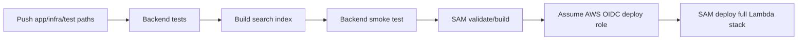
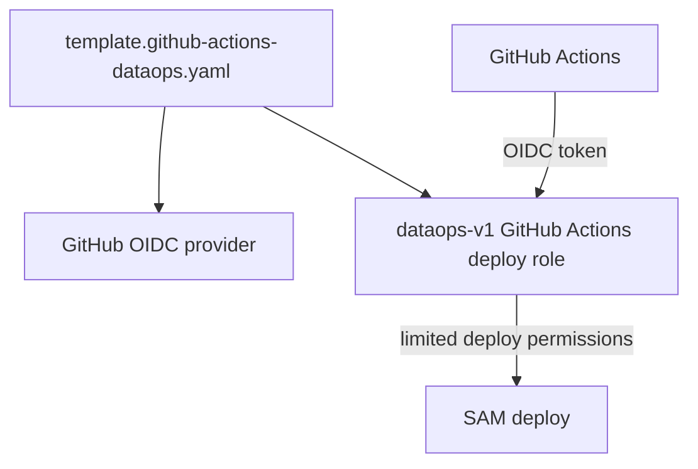

# Architecture

## Summary

The docs app is a protected Lambda-hosted editor for internal DataTalks.Club
operations docs. The important design choice is that GitHub stays the source of
truth for content. Lambda is a runtime editor and cache, not a permanent
filesystem.

The current recommendation is to keep the sandbox lightweight:

- One full docs Lambda for frontend, editing API, and search.
- GitHub for durable markdown storage and review history.
- AWS Secrets Manager for runtime secrets.
- GitHub Actions OIDC for deploy credentials.
- No SQLite, no EC2, no EFS until we have a concrete need for shared warm-cache
  state or larger mutable runtime storage.

## Runtime Architecture



The deployed function is `BackendFunction`, a single TypeScript/Node Lambda
(`backend/dist/handler.handler`). It owns:

- Basic-auth protected frontend serving.
- Docs CRUD and structured-SOP parsing/linting.
- GitHub-backed persistence.
- Search through a `zerosearch-node` index.
- Compatibility `/git/*` endpoints used by the frontend.
- All work `/api/*` routes (tasks, bundles, templates, recurring, files,
  artifacts, assistant jobs, notifications, intake, users) served in-process.

One Lambda serves everything from a single Function URL. There is no separate
work-engine Lambda and no `/work/api/*` proxy hop -- docs and work are one
process. The Lambda Function URL is public at the AWS edge, but the app
requires its own basic-auth session before serving internal docs or work
routes. The password is stored in AWS Secrets Manager.

## Content Save Lifecycle

When a user edits a page in the deployed app, the content path is:



This means clicking `Save` in production already publishes the document to
GitHub. The old local `Commit & push` workflow is still useful in local
development, but in deployed Lambda `/git/commit` is compatibility behavior and
returns that changes are committed automatically.

A content edit made through the UI creates a GitHub commit with a message like:

```text
Update content/community/slack/sops/example.md
```

Images and folder operations follow the same principle: Lambda mutates its
local cache first, then writes or deletes the corresponding files through the
GitHub API.

## Startup and Refresh Lifecycle



On cold start, or after an explicit `/git/pull`, Lambda downloads markdown from
GitHub and rebuilds the search index. On a warm instance, content edited by that
same instance is immediately visible because it rebuilds the index after save.

For content commits made outside a warm Lambda instance, the content-validation
workflow calls the deployed Lambda after validation succeeds. The workflow uses
GitHub OIDC to assume the AWS deploy role and invokes Lambda directly with an
internal `/admin/refresh` event. That avoids storing the app password in GitHub
Actions and avoids redeploying code for content-only changes.

## CI/CD Split

The repository has two different lifecycles.

Content-only changes should be cheap and fast:



App or infrastructure changes need the full deployment path:



Current workflows:

- `.github/workflows/validate-dataops-content.yml`
  - Runs for `content/**` changes.
  - Builds the search index from `content/`.
  - Smoke-tests search against the generated index.
  - On pushes with changed content files, assumes the AWS OIDC deploy role and
    directly invokes the deployed Lambda refresh endpoint.
  - Does not deploy Lambda code.
- `.github/workflows/deploy-dataops-v1.yml`
  - Runs for backend, frontend, infra, package, and deploy script changes.
  - Runs tests and deploys the single backend Lambda stack if checks pass.

## Credentials and CloudFormation

Deployment credentials are managed through CloudFormation, not manually through
long-lived AWS keys in GitHub.



Runtime secrets are also managed through CloudFormation:

- `template.runtime-secrets.yaml` creates or updates the AWS Secrets Manager
  secrets.
- `template.full.yaml` gives the backend Lambda permission to read only those
  secrets.
- GitHub Actions does not store the full-app GitHub token or basic-auth
  password.

The main runtime secrets are:

- `dataops-v1/full-app/github-token`
- `dataops-v1/full-app/basic-auth-password`

## Why Not EFS Right Now

EFS would give Lambda a persistent shared filesystem. That can be useful if we
need shared mutable state across warm instances, larger caches, or files that
should survive Lambda recycling without going through GitHub.

For this app, EFS is not currently worth the operational weight:

- GitHub already provides durable content storage and history.
- The search index is small enough to rebuild quickly.
- Lambda `/tmp` is enough for the markdown cache and generated index.
- EFS adds VPC configuration, mount targets, security groups, and extra cost.

The right trigger for reconsidering EFS is evidence that cold-start downloads or
index rebuilds are too slow, or that we need a shared runtime cache independent
from GitHub.

## Recommended Upgrade Path

1. Harden content refresh observability.
   The content workflow now refreshes the deployed Lambda after validation. The
   next improvement is to expose refresh duration, indexed document count, and
   the source Git commit in workflow logs or Lambda logs.

2. Add stricter content validation.
   The content workflow can run SOP linting across changed files, check broken
   internal links, and verify wiki-style links such as `[[slack-export-dump]]`.

3. Keep app deploys separate from content deploys.
   Code changes should run the full tests and SAM deploy. Content changes should
   validate content and refresh runtime state.

4. Move account-specific values to CloudFormation parameters.
   This makes migration from sandbox to the production AWS account reproducible:
   deploy the OIDC stack, deploy runtime secrets, then deploy the full app stack.

5. Keep shared authentication configuration aligned.
   The DataOps relying-party client, callback/logout URLs, issuer, and JWKS URL
   are non-secret deployment parameters. Cognito and Google provider ownership
   remains in the shared `aws-infra/sandbox/auth` stack.

## Migration Checklist for a New AWS Account

1. Update the shared infra source for the GitHub Actions OIDC deploy role:
   `../aws-infra/sandbox/dataops/template.github-actions.yaml`.
   The `aws-infra` repo does not currently deploy itself through CI/CD, so a
   credentialed AWS operator must apply the `dataops-github-actions`
   CloudFormation stack after this template changes.

2. Provision the GitHub content token used by the application. The historical
   Basic-auth secret template is retained only for old stacks and is not part
   of browser authentication.

3. Update workflow role ARN if the deploy role ARN changes.

4. Push application changes to `main`; GitHub Actions deploys the full app stack
   through OIDC after checks pass.

5. Verify:
   - Login works.
   - A document page loads by path.
   - Search returns results.
   - Work `/api/*` routes return data.
   - Saving a test document creates a GitHub commit.
   - Refresh pulls the latest GitHub content.

## Open Design Decisions

- Whether content-only CI should call a refresh endpoint automatically.
- Whether document saves should commit directly to `main` forever, or move to a
  branch and pull-request model.
- How local DataOps user lifecycle should eventually integrate with the shared
  identity lifecycle without auto-provisioning accounts.
