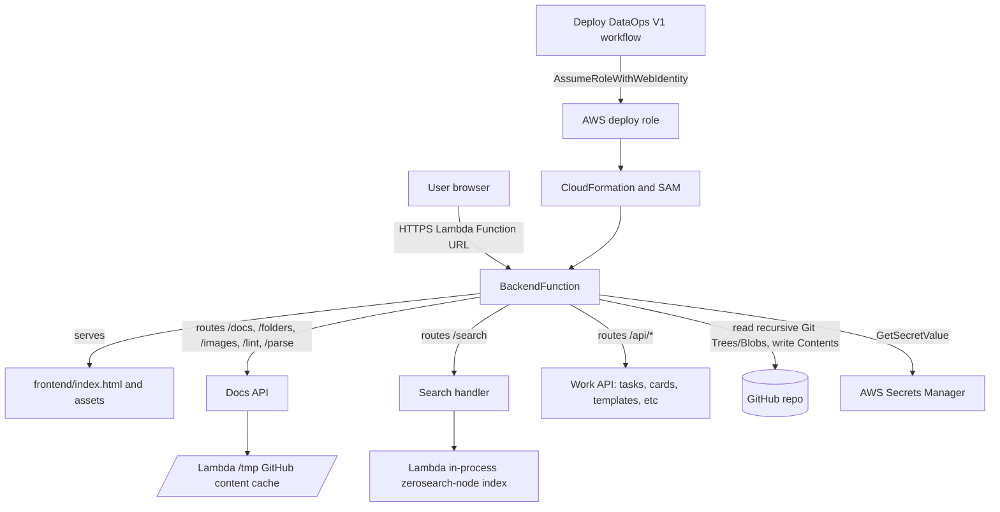
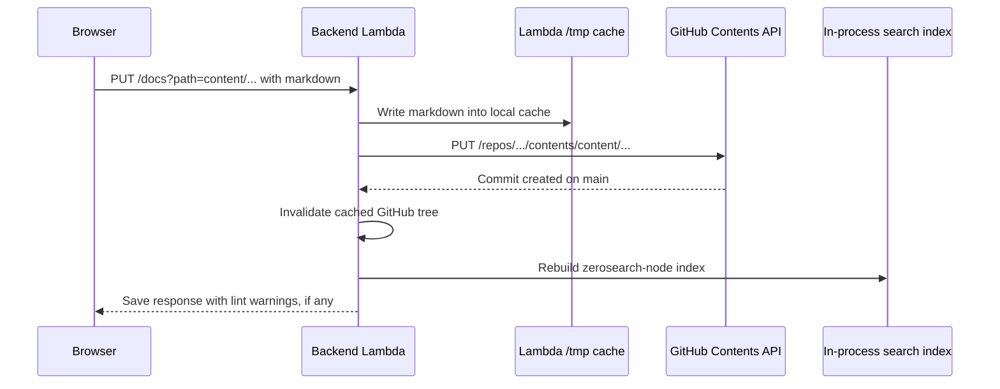
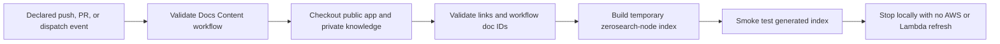
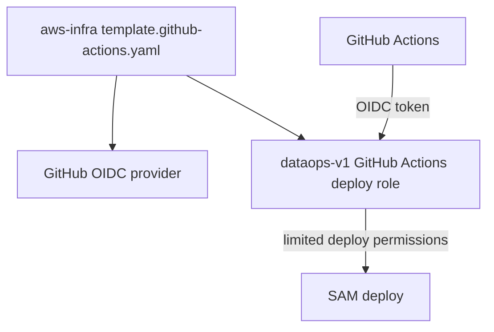

# Architecture

## Summary

The docs app is a protected Lambda-hosted editor for internal DataTalks.Club
operations docs. The important design choice is that GitHub stays the source of
truth for content. Lambda is a runtime editor and cache, not a permanent
filesystem.

The current recommendation is to keep the sandbox lightweight:

- One full docs Lambda for frontend, editing API, and search.
- GitHub for durable markdown storage and review history.
- AWS Secrets Manager for runtime secrets.
- GitHub Actions OIDC for deploy credentials.
- No SQLite, no EC2, no EFS until we have a concrete need for shared warm-cache
  state or larger mutable runtime storage.

## Runtime Architecture


```mermaid
flowchart TB
  User[User browser] -->|HTTPS Lambda Function URL| Backend[BackendFunction]
  Backend -->|serves| Frontend[frontend/index.html and assets]
  Backend -->|routes /docs, /folders, /images, /lint, /parse| DocsApi[Docs API]
  Backend -->|routes /search| Search[Search handler]
  Backend -->|routes /api/*| WorkApi[Work API: tasks, cards, templates, etc]
  DocsApi --> Cache[/Lambda /tmp GitHub content cache/]
  Search --> Index[Lambda in-process zerosearch-node index]
  Backend -->|read recursive Git Trees/Blobs, write Contents| GitHub[(GitHub repo)]
  Backend -->|GetSecretValue| Secrets[AWS Secrets Manager]
  DeployWorkflow[Deploy DataOps V1 workflow] -->|AssumeRoleWithWebIdentity| DeployRole[AWS deploy role]
  DeployRole --> CloudFormation[CloudFormation and SAM]
  CloudFormation --> Backend
```

The deployed function is `BackendFunction`, a single TypeScript/Node Lambda
(`backend/dist/handler.handler`). It owns:

- Basic-auth protected frontend serving.
- Docs CRUD and structured-SOP parsing/linting.
- GitHub-backed persistence.
- Search through a `zerosearch-node` index.
- Read-only `GET /git/status` and `GET /git/log` diagnostics; every request to
  another `/git/*` route, and every method other than GET on those routes,
  returns HTTP 405.
- All work `/api/*` routes (tasks, cards, templates, recurring, files,
  artifacts, assistant jobs, notifications, intake, users) served in-process.

One Lambda serves everything from a single Function URL. There is no separate
work-engine Lambda and no `/work/api/*` proxy hop -- docs and work are one
process. The Lambda Function URL is public at the AWS edge, but the app
requires its own basic-auth session before serving internal docs or work
routes. The password is stored in AWS Secrets Manager.

## Content Save Lifecycle

When a user edits a page in the deployed app, the content path is:


```mermaid
sequenceDiagram
  participant U as Browser
  participant L as Backend Lambda
  participant T as Lambda /tmp cache
  participant G as GitHub Contents API
  participant I as In-process search index

  U->>L: PUT /docs?path=content/... with markdown
  L->>T: Write markdown into local cache
  L->>G: PUT /repos/.../contents/content/...
  G-->>L: Commit created on main
  L->>L: Invalidate cached GitHub tree
  L->>I: Rebuild zerosearch-node index
  L-->>U: Save response with lint warnings, if any
```

This means clicking `Save` in production already publishes the document to
GitHub through the Contents API. There is no separate deployed commit, push, or
pull step.

A content edit made through the UI creates a GitHub commit with a message like:

```text
Update content/community/slack/sops/example.md
```

Images and folder operations follow the same principle: Lambda mutates its
local cache first, then writes or deletes the corresponding files through the
GitHub API.

## Content Hydration and Search Lifecycle

```mermaid
sequenceDiagram
  participant L as Backend Lambda
  participant G as GitHub
  participant T as Lambda /tmp cache
  participant I as Search index

  L->>G: GET recursive Git Trees API entry for configured branch
  G-->>L: Markdown and image blob entries
  L->>G: GET Blob API entries by tree SHA
  L->>T: Write canonical content assets into the cache
  Note over L,T: Collection reads stop here; docs search continues
  L->>I: Build zerosearch-node index
```

The docs runtime is created lazily. A collection read, corpus lint, registry,
folder operation, save, or docs search calls `ensureSynced()`: the store fetches
the configured branch's recursive Git tree once, then fetches a Blob for each
canonical markdown file under `content/` and supported image under
`content/images/` that is not already present in `/tmp`. After that one-shot
synchronization succeeds, later collection reads reuse the hydrated cache. A
single-document read can happen earlier and more narrowly: its `ensureFile`
path consults the same recursive tree and fetches only the requested blob.

A docs search first ensures the synchronized cache exists, then builds the
`zerosearch-node` index from that cache. On a warm instance, content edited
through that same instance remains immediately visible to search because every
document/image/folder mutation updates the local cache, commits through the
GitHub Contents API, invalidates the cached in-memory tree so its next lookup
reloads it, and synchronously rebuilds the process-local search index before
returning.

For content commits made outside that warm instance, there is no automatic
cross-instance refresh signal. The existing environment retains its hydrated
files and last rebuilt index until Lambda recycles or resets it. A newly
initialized environment performs the same lazy hydration on its next matching
request. The deployed Git surface is otherwise read-only: `GET /git/status` and
`GET /git/log` return unavailable diagnostics, while every other `/git/*`
request returns HTTP 405. This runtime refresh lifecycle is separate from CI
content validation.

## CI/CD Split

The repository has two different lifecycles.

Content-only changes should be cheap and fast:

Content validation stays on the GitHub Actions runner.
Repository-local `content/` remains transitional public-sensitive migration
debt; the workflow validates and indexes canonical private knowledge instead:


```mermaid
flowchart LR
  Trigger[Declared push, PR, or dispatch event] --> Validate[Validate Docs Content workflow]
  Validate --> Checkouts[Checkout public app and private knowledge]
  Checkouts --> ValidateLinks[Validate links and workflow doc IDs]
  ValidateLinks --> BuildIndex[Build temporary zerosearch-node index]
  BuildIndex --> Smoke[Smoke test generated index]
  Smoke --> Stop[Stop locally with no AWS or Lambda refresh]
```

App or infrastructure changes need the full deployment path:


```mermaid
flowchart LR
  CodePush[Push app/infra/test paths] --> Checks[checks job]
  Checks --> UnitChecks[Frontend/backend tests and transaction gate]
  UnitChecks --> TypeAndBuild[Typecheck and build backend]
  TypeAndBuild --> SamValidate[Set up SAM and validate template]
  SamValidate --> DeployJob[deploy job waits for checks]
  DeployJob --> OIDC[Configure AWS credentials through OIDC]
  OIDC --> Package[SAM build and packaged-boundary checks]
  Package --> Deploy[SAM deploy full Lambda stack]
```

Current workflows:

- `.github/workflows/validate-dataops-content.yml`
  - Runs on pushes to `main` for its declared paths, on pull requests for its
    declared paths, and by manual dispatch. The push filter includes `docs/**`,
    while the current pull-request filter does not.
  - Checks out this public application repository and canonical
    `DataTalksClub/dataops-knowledge` at `.knowledge`. The private checkout uses
    the `DATAOPS_CONTENT_GITHUB_TOKEN` secret with contents-read access and does
    not persist its credentials.
  - Sets up Python with uv and installs Node workspace dependencies.
  - Validates links and workflow document IDs with the backend TypeScript
    `validate-docs-links` script against `.knowledge/content`.
  - Builds a temporary `zerosearch-node` index from that canonical private
    knowledge content into `.tmp` and smoke-tests the generated index.
  - Performs no AWS credential assumption, Lambda invocation,
    `/admin/refresh` request, deployment, or mutation of a deployed Lambda
    cache or index.
  - Declaring `tools/content_tools/**` as a trigger does not mean that the
    workflow directly invokes the Python content tools; its executable
    validation and indexing steps currently call backend TypeScript scripts.
- `.github/workflows/deploy-dataops-v1.yml`
  - Runs for its declared application, infrastructure, packaging, content, and
    deploy-script paths.
  - Runs the dependent `checks` job first: frontend coverage, backend tests, the
    Task/Card transaction gate, backend typecheck/build, and SAM template
    validation.
  - Then runs the dependent `deploy` job: check out and set up Node/SAM, assume
    the AWS OIDC deploy role, build and verify the SAM artifact, deploy the
    single backend Lambda stack, synchronize runtime seeds, and smoke-test the
    deployed backend URL.

## Credentials and CloudFormation

Deployment credentials are managed through CloudFormation, not manually through
long-lived AWS keys in GitHub.


```mermaid
flowchart TB
  CFN[aws-infra template.github-actions.yaml] --> OIDCProvider[GitHub OIDC provider]
  CFN --> Role[dataops-v1 GitHub Actions deploy role]
  GitHubActions[GitHub Actions] -->|OIDC token| Role
  Role -->|limited deploy permissions| SAM[SAM deploy]
```

Runtime secrets are also managed through CloudFormation:

- `aws-infra` `sandbox/dataops/template.runtime-secrets.yaml` creates or updates the AWS Secrets Manager
  secrets.
- `template.full.yaml` gives the backend Lambda permission to read only those
  secrets.
- GitHub Actions does not store the full-app GitHub token or basic-auth
  password.

The main runtime secrets are:

- `dataops-v1/full-app/github-token`
- `dataops-v1/full-app/basic-auth-password`

## Why Not EFS Right Now

EFS would give Lambda a persistent shared filesystem. That can be useful if we
need shared mutable state across warm instances, larger caches, or files that
should survive Lambda recycling without going through GitHub.

For this app, EFS is not currently worth the operational weight:

- GitHub already provides durable content storage and history.
- The search index is small enough to rebuild quickly.
- Lambda `/tmp` is enough for the markdown cache.
- EFS adds VPC configuration, mount targets, security groups, and extra cost.

The right trigger for reconsidering EFS is evidence that lazy hydration or index
rebuilds are too slow, or that we need a shared runtime cache independent from
GitHub.

## Recommended Upgrade Path

1. Harden runtime-refresh observability.
   The deployed Lambda lazily hydrates from Git Trees/Blobs, builds its index
   before the first docs search, rebuilds after warm saves made through that
   same instance, and does not automatically observe external commits until
   recycled. A useful next improvement is to expose synchronization duration,
   indexed document count, and the source Git commit in Lambda logs.

2. Add stricter content validation.
   The content workflow already validates links, wiki-style references, and
   workflow document IDs. A later improvement can add SOP linting across changed
   files without changing the CI-to-runtime boundary.

3. Keep content validation separate from app deployment.
   Code changes should run the full tests and SAM deploy. Content changes should
   validate canonical knowledge and smoke-test a locally generated search index;
   content validation does not deploy or refresh runtime state.

4. Move account-specific values to CloudFormation parameters.
   This makes migration from sandbox to the production AWS account reproducible:
   deploy the OIDC stack, deploy runtime secrets, then deploy the full app stack.

5. Keep shared authentication configuration aligned.
   The DataOps relying-party client, callback/logout URLs, issuer, and JWKS URL
   are non-secret deployment parameters. Cognito and Google provider ownership
   remains in the shared `aws-infra/sandbox/auth` stack.

## Migration Checklist for a New AWS Account

1. Update the shared infra source for the GitHub Actions OIDC deploy role:
   `../aws-infra/sandbox/dataops/template.github-actions.yaml`.
   The `aws-infra` repo does not currently deploy itself through CI/CD, so a
   credentialed AWS operator must apply the `dataops-github-actions`
   CloudFormation stack after this template changes.

2. Provision the GitHub content token used by the application. The historical
   Basic-auth secret template is retained only for old stacks and is not part
   of browser authentication.

3. Update workflow role ARN if the deploy role ARN changes.

4. Push application changes to `main`; GitHub Actions deploys the full app stack
   through OIDC after checks pass.

5. Verify:
   - Login works.
   - A document page loads by path.
   - Search returns results.
   - Work `/api/*` routes return data.
   - Saving a test document creates a GitHub commit.
   - A newly initialized runtime hydrates the latest GitHub content on its first
     matching docs request.

## Open Design Decisions

- Whether a future cross-instance runtime-refresh signal is warranted; none
  exists today.
- Whether document saves should commit directly to `main` forever, or move to a
  branch and pull-request model.
- How local DataOps user lifecycle should eventually integrate with the shared
  identity lifecycle without auto-provisioning accounts.
