# Create events on LinkedIn
## Summary
- Purpose:
- Outcome:
- Trigger:
- Frequency:

## Prerequisites

- Access:
- Tools:
- Inputs:

## Procedure

How to create events on LinkedIn
This procedure will show you the steps on how to create events on LinkedIn.

Step-by-step Instructions
1.  The first need you will be doing is to visit the [DataTalksClub LinkedIn account](https://www.linkedin.com/company/71802369/admin/dashboard/)- viewed as an admin.

    Note: Make sure you are logged in into your LinkedIn account and receive an admin invite from Alexey for you to have access to the DataTalksClub Linkedin.

    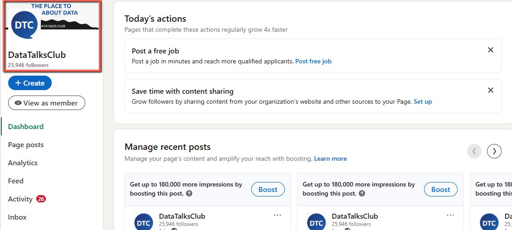
    Image note: This screenshot anchors step 1 of the Create events on LinkedIn process by showing the screen for the first need you will be doing is to visit the DataTalksClub LinkedIn account viewed as an admin. Look for the red box, arrow, selected row, or highlighted screen area, then use that highlighted area as the target for the action before continuing.

2.  On the left side of the screen click " + Create".

    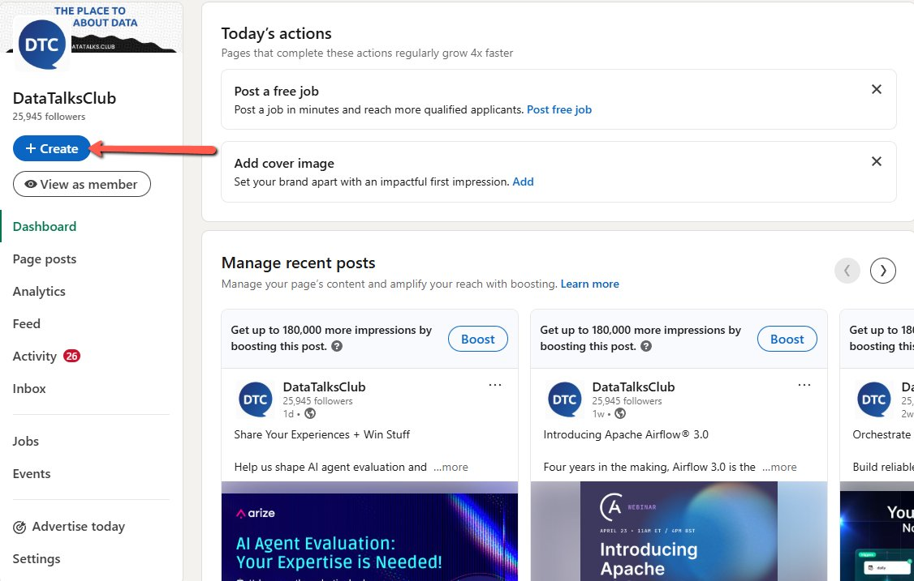
    Image note: This screenshot anchors step 2 of the Create events on LinkedIn process by showing the screen for on the left side of the screen click " + Create". Look for the red box or arrow around "+ Create", then use that highlighted area as the target for the action before continuing.

3.  Then click “Create an Event”.

    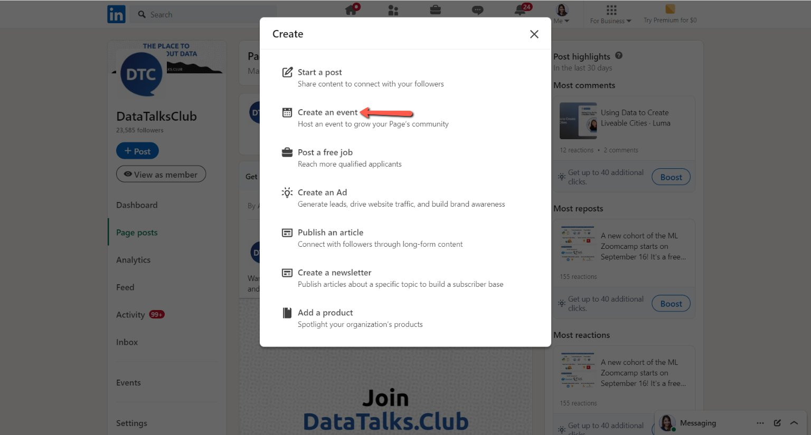
    Image note: This screenshot anchors step 3 of the Create events on LinkedIn process by showing the screen for then click "Create an Event". Look for the red box or arrow around "Create an Event", then use that highlighted area as the target for the action before continuing.

4.  Attach the banner of the event by clicking "Upload cover image"

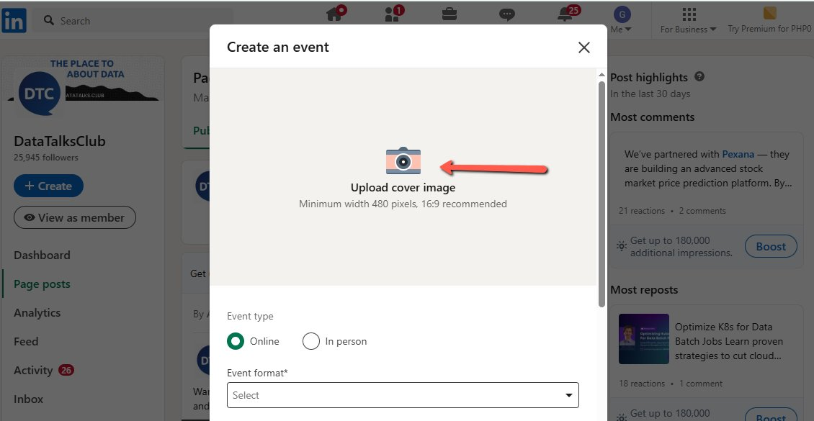
Image note: This screenshot anchors step 4 of the Create events on LinkedIn process by showing the screen for attach the banner of the event by clicking "Upload cover image". Look for the red box or arrow around "Upload cover image", then use that highlighted area as the target for the action before continuing.

5.  Select the picture on your computer and click "open".

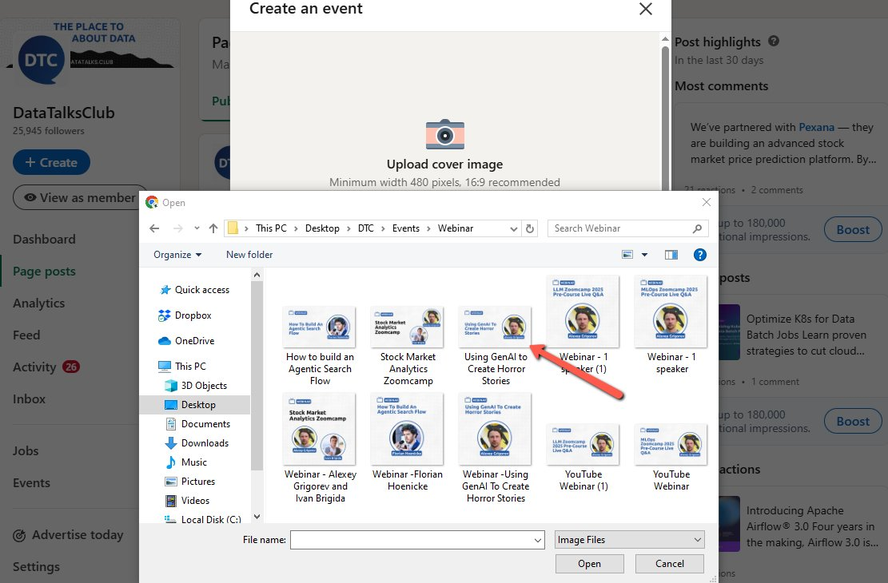
Image note: This screenshot anchors step 5 of the Create events on LinkedIn process by showing the screen for select the picture on your computer and click "open". Look for the red box or arrow around "open", then use that highlighted area as the target for the action before continuing.

6.  Click “Apply”

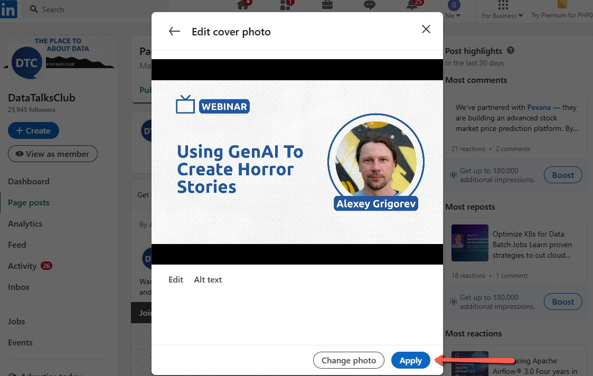
Image note: This screenshot anchors step 6 of the Create events on LinkedIn process by showing the screen for click "Apply". Look for the red box or arrow around "Apply", then use that highlighted area as the target for the action before continuing.

7.  Ensure that the "Event Type" is set to "Online." Click the drag down button under "Event Format" and select "External event link"

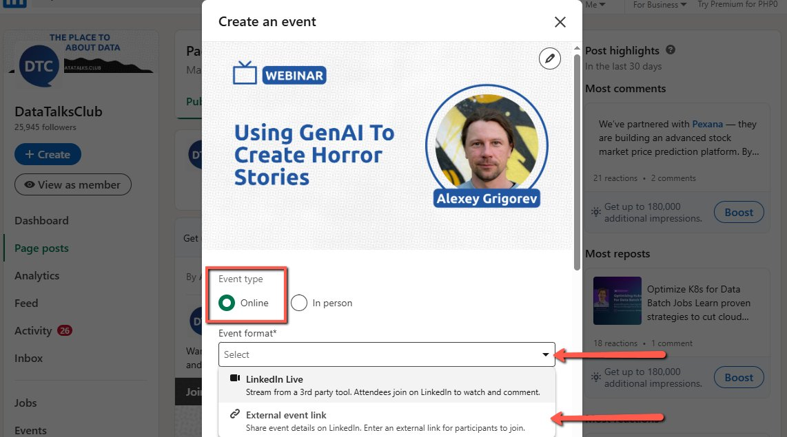
Image note: This screenshot anchors step 7 of the Create events on LinkedIn process by showing the screen for ensure that the "Event Type" is set to "Online." Click the drag down button under "Event Format" and select. Look for the red boxes or arrows around "Event Type", "Online", "Event Format", then use that highlighted area as the target for the action before continuing.

8.  Type the event name and select the timezone (UTC +02:00) for Amsterdam, Berlin, Bern, Rome, Stockholm, or Vienna.

Note: In this example, the event name is "Using GenAI to Create Horror Stories"

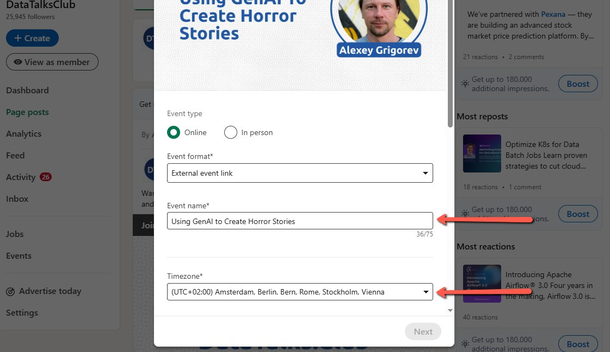
Image note: This screenshot anchors step 8 of the Create events on LinkedIn process by showing the screen for type the event name and select the timezone (UTC +02:00) for Amsterdam, Berlin, Bern, Rome, Stockholm, or Vienna. Look for the red box, arrow, selected row, or highlighted screen area, then use that highlighted area as the target for the action before continuing.

9.  Scroll down, select the start date and the end time of the event.

    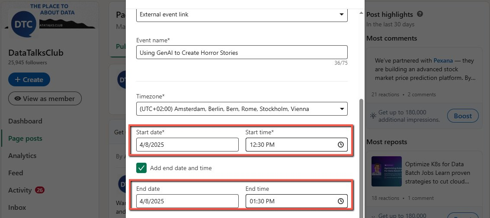
    Image note: This screenshot anchors step 9 of the Create events on LinkedIn process by showing the screen for scroll down, select the start date and the end time of the event. Look for the red box, arrow, selected row, or highlighted screen area, then use that highlighted area as the target for the action before continuing.

10. For the External event link, paste the *Youtube of DataTalksClub: [https://www.youtube.com/datatalksclub](https://www.youtube.com/datatalksclub)*
For the “Description”, just copy the description of the event from [meetup.com](https://www.meetup.com/home/?suggested=true&source=EVENTS&customStartDate=2024-09-09T12%3A00%3A00-04%3A00)
Note: You can edit the format of the description of the event like justifications, spacing, etc.
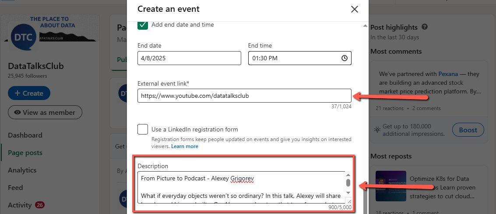
Image note: This screenshot anchors step 10 of the Create events on LinkedIn process by showing the screen for for the External event link, paste the Youtube of DataTalksClub: https://www.youtube.com/datatalksclub For the. Look for the red box or arrow around "Description", then use that highlighted area as the target for the action before continuing.

11. And then, type the name of the speaker under "Speakers" and click “Next”.

    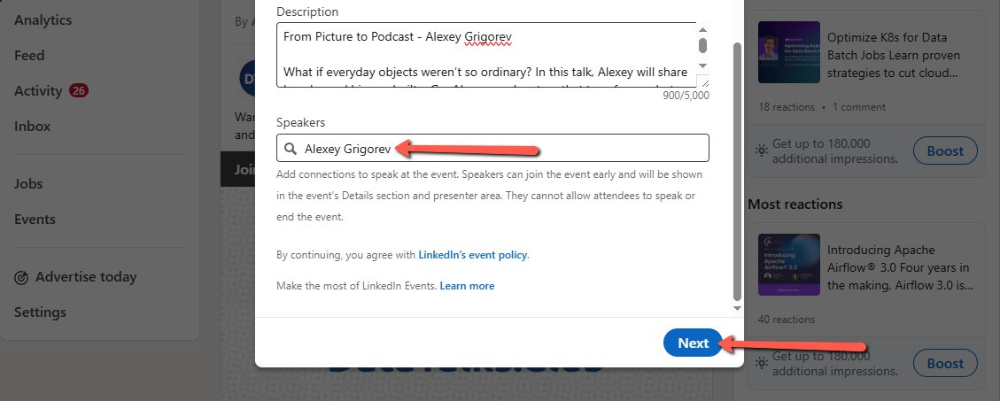
    Image note: This screenshot anchors step 11 of the Create events on LinkedIn process by showing the screen for , type the name of the speaker under "Speakers" and click "Next". Look for the red boxes or arrows around "Speakers", "Next", then use that highlighted area as the target for the action before continuing.

12. After clicking, add more description for your event by typing in the space provided and click “Post”. Use [Templates. New event announcements (podcasts, webinars, workshops)](https://docs.google.com/document/d/1dlfDANCHK_ococ9BwIfzbZCIDe5zRWggWDmp51mIkSQ/edit?tab=t.0#heading=h.1bcf6pbw356p)
    Post description:
    Join us this (Date of the event) to learn about (Title of the event) with (Speakers Name).

(They, He, She'll) cover:

- XX

- XX

- XX

Register here: (event link from Luma)

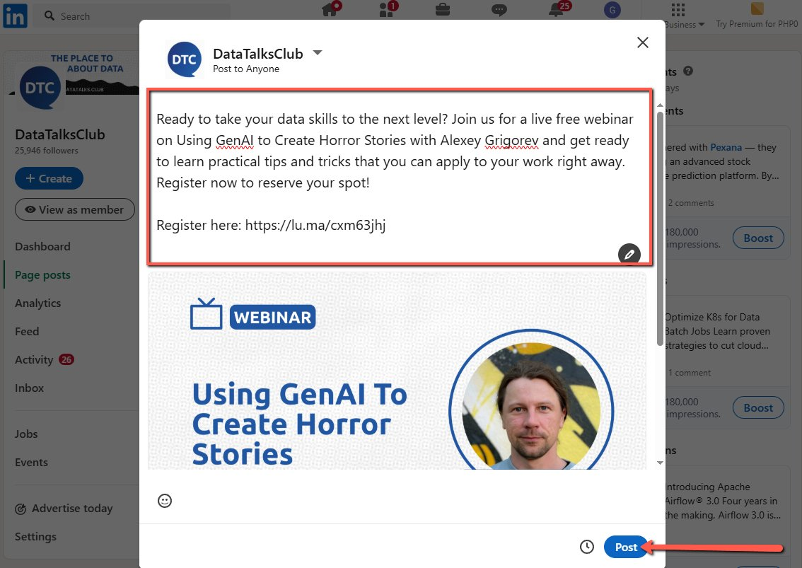
Image note: This screenshot anchors step 12 of the Create events on LinkedIn process by showing the screen for after clicking, add more description for your event by typing in the space provided and click "Post". Use. Look for the red box or arrow around "Post", then use that highlighted area as the target for the action before continuing.

## Validation

-

## Troubleshooting

-

## References

-
